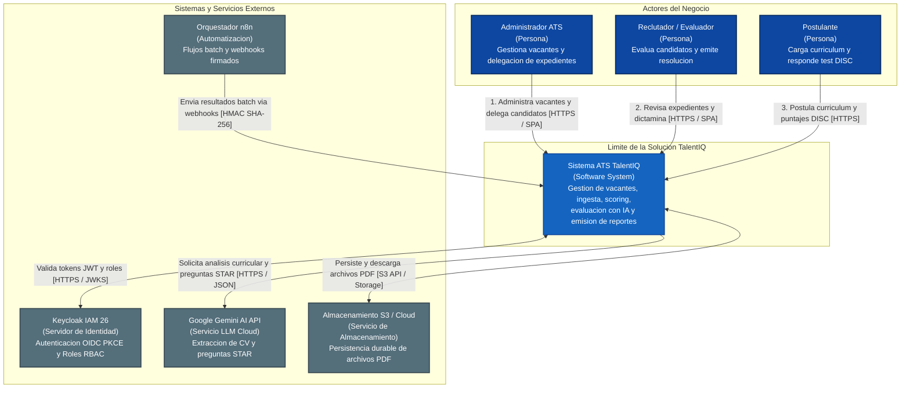
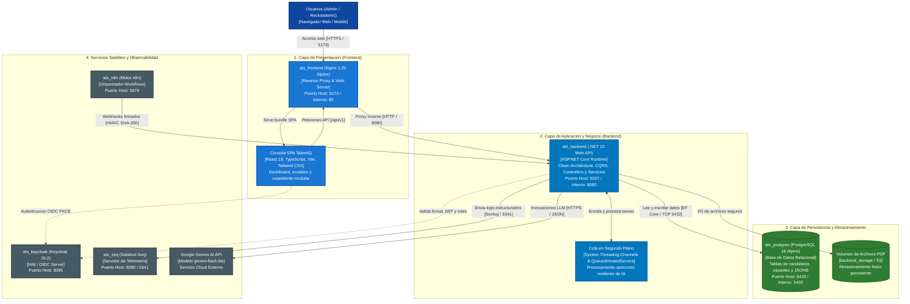
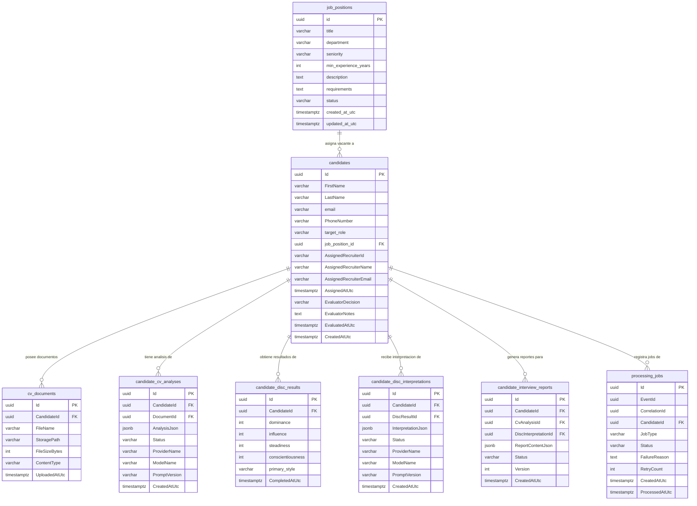
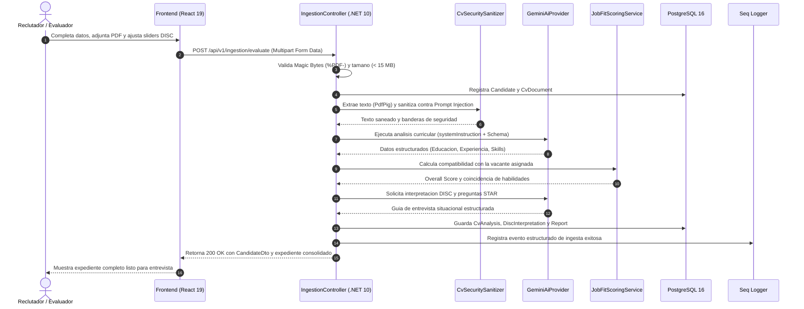
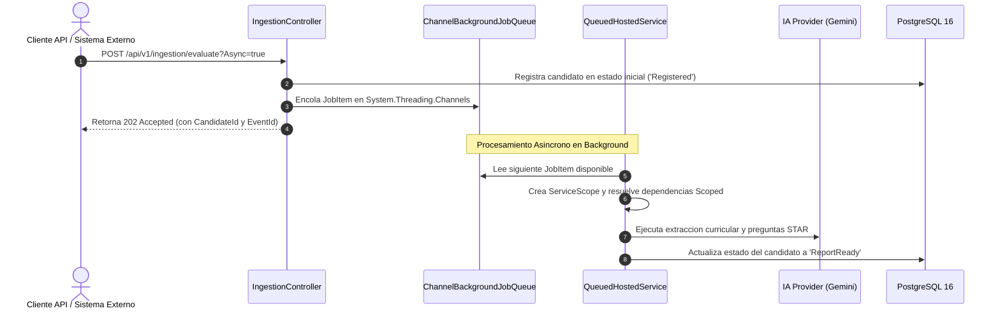
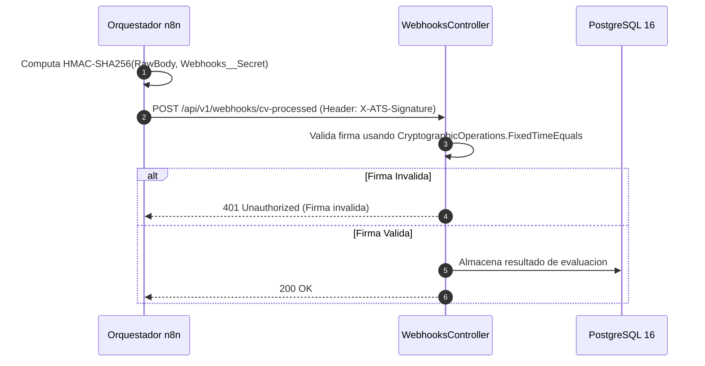

# Documentacion Tecnica de Solucion: ATS TalentIQ

## Sistema Integral de Seleccion y Evaluacion de Talento Asistido por IA

- **Proyecto:** ATS TalentIQ (Applicant Tracking System)
- **Version:** 2.6
- **Fecha de emision:** 8 de septiembre de 2026
- **Version:** 2.8
- **Fecha de emision:** 9 de septiembre de 2026
- **Estado del documento:** Aprobado e Implementado
- **Ambiente:** Desarrollo / Preproduccion (Local Contenerizado)
- **Clasificacion:** Documento Tecnico de Arquitectura de Software

---

## 1. Resumen o Introduccion

ATS TalentIQ es una plataforma empresarial contenerizada de seleccion de talento diseñada para gestionar de forma integral el ciclo de admision de postulantes, la gestion formal de vacantes laborales y la evaluacion automatizada curricular y psicometrica.
ATS TalentIQ es una plataforma empresarial contenerizada de seleccion de talento diseñada para gestionar de forma integral el ciclo de admision de postulantes, la gestion formal de vacantes laborales y la evaluacion automatizada curricular y psicometrica bajo supervision humana soberana (*Human-in-the-Loop*).

El sistema articula modelos avanzados de Inteligencia Artificial Generativa (Google Gemini AI bajo el modelo de alta eficiencia `gemini-flash-lite-latest` con contingencia multi-modelo y proveedor `MockAiProvider` para entornos aislados), evaluacion conductual fundamentada en la metodologia psicometrica DISC (Dominancia, Influencia, Estabilidad, Cumplimiento) y generacion automatizada de guias de indagacion situacional estructuradas bajo metodologia STAR (Situacion, Tarea, Accion, Resultado).

### 1.1 Enfoque Arquitectonico y Principios Rectores
La solucion ha sido construida siguiendo los principios de la Arquitectura Limpia (Clean Architecture) en .NET 10, complementada con el patron CQRS (Command Query Responsibility Segregation) y una estricta orientacion a interfaces y principios SOLID:

1. **Independencia del Motor de IA:** La logica de negocio interactua exclusivamente con la interfaz `IAiProvider`. La implementacion productiva de Gemini AI puede intercambiarse por modelos locales (Ollama/Llama 3), Azure OpenAI, Anthropic Claude o mock fakes sin alterar ninguna regla del dominio ni los casos de uso.
2. **Independencia de Persistencia:** Los repositorios implementan abstracciones de persistencia desacopladas mediadas por Entity Framework Core 10 sobre PostgreSQL 16. La base de datos puede sustituirse o actualizarse mediante migraciones declarativas en C#.
3. **Independencia de Presentacion:** La API REST expone contratos JSON estrictos y versionados (`/api/v1`), consumidos por una consola web ejecutiva en React 19 desacoplada a traves de variables de entorno (`VITE_API_BASE_URL`).
4. **Resiliencia y Procesamiento en Segundo Plano:** El procesamiento curricular pesado puede ejecutarse en tiempo real de forma sincronica o delegarse a la cola en segundo plano desacoplada `IBackgroundJobQueue` (basada en canales en memoria `System.Threading.Channels` y `QueuedHostedService`), garantizando alta disponibilidad ante picos de demanda.
5. **Seguridad Defensiva Multicapa:** Blindaje heuristico contra inyeccion de instrucciones (*Prompt Injection*), verificacion automatica de citas textuales de competencias (*Evidence Grounding Check*), prevencion de *Path Traversal* y comparacion en tiempo constante de firmas criptograficas HMAC SHA-256 (`CryptographicOperations.FixedTimeEquals`).
6. **Supervision Humana Soberana y Etica de la IA (Human-in-the-Loop):** La Inteligencia Artificial opera exclusivamente como herramienta utilitaria de asistencia y estructuracion fáctica para Recursos Humanos. La IA no califica de forma vinculante ni aprueba o descarta candidatos. El porcentaje visible refleja un "Cotejo de Requisitos Detectados en el CV", reservando la toma de decisiones y el dictamen oficial al criterio soberano de los evaluadores humanos.
7. **Inspeccion Documental Interactiva (Visor Web de CV):** Incorporacion de visor interactivo web del currículum original en PDF transmitido via streaming seguro autenticado (`GET /api/v1/documents/cv/{candidateId}`). Permite a los reclutadores contrastar la síntesis asistida contra el documento original sin requerir descargas locales, soportando alternancia fluida de vistas y persistencia en memoria mediante `useRef`.

---

## 2. Dependencias Principales

### 2.1 Estructura de la Solucion (`Ats.slnx`)
La solucion esta estructurada en capas concentricas que garantizan el aislamiento de dependencias:

```text
Ats.slnx
├── backend/src/
│   ├── Ats.Domain/                 # Nucleo puro: Entidades, Value Objects, Enums, Eventos de Dominio
│   ├── Ats.Application/            # Casos de uso CQRS, DTOs, Validadores (FluentValidation), Interfaces
│   ├── Ats.Infrastructure/         # Adaptadores externos: EF Core, Gemini AI, Mock AI, Storage, Cache, Jobs, PDF
│   └── Ats.Api/                    # Controladores REST, Middlewares, Autenticacion Keycloak JWT, Swagger
├── backend/tests/
│   └── Ats.Tests/                  # Pruebas unitarias de seguridad, sanitizacion, scoring de vacantes y habilidades
└── tests/
    ├── Ats.Domain.UnitTests/       # Pruebas unitarias del modelo de dominio y Value Objects
    ├── Ats.Application.UnitTests/  # Pruebas unitarias de handlers CQRS y logica de orquestacion
    └── Ats.ArchitectureTests/      # Pruebas de cumplimiento de arquitectura limpia (dependencias entre capas)
```

### 2.2 Principales Caracteristicas
- **Control de Acceso Basado en Roles (RBAC):** Integracion con Keycloak 26 mediante OpenID Connect y autorizacion por politicas (`ats_admin`, `ats_recruiter`).
- **Validacion de Entrada:** FluentValidation integrado en el pipeline de ejecucion de comandos.
- **Manejo Centralizado de Excepciones:** Middleware global que emite respuestas estandarizadas RFC 7807 (`ProblemDetails`).
- **Almacenamiento Desacoplado:** Soporte dinamico para almacenamiento local seguro y Amazon S3 mediante la interfaz `IStorageService`.
- **Caché en Memoria:** Implementacion de `ICacheService` para reducir la carga de lectura en catalogos estaticos.
- **Logging Estructurado:** Serilog configurado con enriquecedores de contexto e ingesta hacia Seq.

### 2.3 Dependencias Principales (Paquetes y Librerias)
- **ASP.NET Core 10:** Framework principal de ejecucion de la API REST.
- **Microsoft.EntityFrameworkCore 10:** Mapeador objeto-relacional (ORM).
- **Npgsql.EntityFrameworkCore.PostgreSQL 10:** Proveedor relacional para PostgreSQL.
- **Microsoft.AspNetCore.Authentication.JwtBearer 10:** Validacion de tokens de identidad Keycloak.
- **FluentValidation.DependencyInjectionExtensions:** Validacion declarativa de comandos.
- **QuestPDF 2025:** Motor de diseno y generacion en memoria de informes pre-entrevista ejecutivos en PDF.
- **PdfPig 0.1:** Extraccion de texto estructurado desde archivos PDF sin dependencias nativas externas.
- **Serilog.AspNetCore & Serilog.Sinks.Seq:** Telemetria y logging estructurado centralizado.

### 2.4 Configuracion
La configuracion del sistema se gestiona mediante inyeccion de dependencias jerarquica:
- `backend/src/Ats.Api/appsettings.json`: Valores base para todos los entornos.
- `backend/src/Ats.Api/appsettings.Development.json`: Sobrescrituras para desarrollo local.
- **Variables de Entorno del Sistema:** Claves maestras inyectadas en tiempo de ejecucion (`Gemini__ApiKey`, `Webhooks__Secret`, `Ingestion__ApiKey`, `ConnectionStrings__DefaultConnection`).

### 2.5 Ejecucion del Proyecto
1. **Requisitos Previos:** .NET 10 SDK, Node.js 22 LTS, Docker Desktop o Docker Engine.
2. **Levantamiento Integral Contenerizado:**
   ```bash
   docker compose up -d --build
   ```
3. **Ejecucion Local del Backend (.NET 10):**
   ```bash
   cd backend/src/Ats.Api
   dotnet run
   ```
4. **Ejecucion Local del Frontend (React 19 + Vite):**
   ```bash
   cd frontend
   npm install
   npm run dev
   ```

### 2.6 Endpoints y Utilidades
- **Ruta Base de la API:** `/api/v1`
- **Swagger / OpenAPI UI:** `http://localhost:5027/swagger` (entornos de desarrollo)
- **Health Check:** `http://localhost:5027/health`
- **Consola Web Frontend:** `http://localhost:5173`
- **Servidor Keycloak IAM:** `http://localhost:8085`
- **Consola de Telemetria Seq:** `http://localhost:8080`

### 2.7 Contacto y Soporte
- Responsable Tecnico: Equipo de Arquitectura de Software ATS
- Canal de Atencion: Ingenieria de Software y Seleccion de Talento

---

## 3. Arquitectura de Solucion

### 3.1 Nivel C1 – Diagrama de Contexto del Sistema
Ilustra los limites del sistema ATS TalentIQ, los actores principales del negocio y los servicios externos integrados:



---

### 3.2 Nivel C2 – Diagrama de Contenedores
Describe la distribucion de contenedores, aplicaciones y almacenes de datos estructurados por capas funcionales:



---

### 3.3 Nivel C3 – Diagrama de Componentes (Backend REST API)
Detalla la organizacion modular interna de la API backend y la interaccion entre controladores, casos de uso CQRS, entidades de dominio y adaptadores de infraestructura:

```mermaid
flowchart TD
    classDef api fill:#1565c0,stroke:#0d47a1,color:#ffffff,stroke-width:2px;
    classDef app fill:#0277bd,stroke:#01579b,color:#ffffff,stroke-width:2px;
    classDef domain fill:#ef6c00,stroke:#e65100,color:#ffffff,stroke-width:2px;
    classDef infra fill:#2e7d32,stroke:#1b5e20,color:#ffffff,stroke-width:2px;
    classDef ext fill:#455a64,stroke:#263238,color:#ffffff,stroke-width:2px;

    Client["Peticiones HTTP entrantes (Frontend / Webhooks)"]

    subgraph CapaApi ["1. Capa API / Controladores REST (Ats.Api)"]
        direction TB
        IngCtrl["IngestionController<br/>POST /api/v1/ingestion/evaluate"]:::api
        CandCtrl["CandidatesController<br/>GET /api/v1/candidates<br/>POST /api/v1/candidates/{id}/decision"]:::api
        DocCtrl["DocumentsController<br/>GET /api/v1/documents/cv/{id}"]:::api
        JobCtrl["JobPositionsController<br/>GET, POST /api/v1/positions"]:::api
        RepCtrl["ReportsController<br/>GET /api/v1/reports/{id}/pdf"]:::api
        WhCtrl["WebhooksController<br/>POST /api/v1/webhooks/*"]:::api
        MwErr["GlobalExceptionHandlerMiddleware<br/>ProblemDetails RFC 7807"]:::api
    end

    subgraph CapaApp ["2. Capa de Aplicacion / Casos de Uso (Ats.Application - CQRS)"]
        direction TB
        HIngest["IngestCandidateCommandHandler<br/>Orquestacion de evaluacion integral"]:::app
        HGetCand["GetCandidatesQueryHandler<br/>Consultas por lote optimizadas"]:::app
        HGetCvDoc["GetCandidateCvDocumentQueryHandler<br/>Streaming de CV original en PDF"]:::app
        HJobFit["JobFitScoringService<br/>Calculo de compatibilidad con vacante"]:::app
        HReportPdf["GetReportPdfQueryHandler<br/>Consolidacion de datos para PDF"]:::app
        HAssign["AssignCandidateCommandHandler<br/>Delegacion de evaluador"]:::app
    end

    subgraph CapaDominio ["3. Capa de Dominio (Ats.Domain)"]
        direction TB
        EntCandidate["Candidate<br/>[Aggregate Root]"]:::domain
        EntJob["JobPosition<br/>[Entity]"]:::domain
        EntAnalysis["CvAnalysis & DiscInterpretation<br/>[Entities / Value Objects]"]:::domain
        EntReport["InterviewReport<br/>[Entity]"]:::domain
    end

    subgraph CapaInfra ["4. Capa de Infraestructura (Ats.Infrastructure)"]
        direction TB
        AppDb["ApplicationDbContext & Repositorios<br/>PostgreSQL 16 + Migraciones EF Core"]:::infra
        AiRouter["IA Provider Router<br/>GeminiAiProvider / MockAiProvider"]:::infra
        JobQueue["ChannelBackgroundJobQueue<br/>& QueuedHostedService"]:::infra
        StorageSvc["LocalStorageService / S3StorageService<br/>Gestion segura de archivos"]:::infra
        PdfGen["QuestPdfReportGenerator<br/>Renderizado de informe de 2 paginas"]:::infra
        Sanitizer["CvSecuritySanitizer<br/>Heuristica anti-inyeccion"]:::infra
    end

    subgraph DestinosExternos ["Destinos de Persistencia e Integracion Externa"]
        direction TB
        Postgres[("PostgreSQL 16 Alpine")]:::ext
        GeminiAPI["Google Gemini API Cloud"]:::ext
        StorageVol[("Almacenamiento Local / S3")]:::ext
    end

    Client --> CapaApi

    IngCtrl -->|"Invoca (Sincrono)"| HIngest
    IngCtrl -->|"Encola (Asincrono)"| JobQueue
    CandCtrl -->|"Consulta"| HGetCand
    CandCtrl -->|"Asigna / Dictamina"| HAssign
    DocCtrl -->|"Solicita stream"| HGetCvDoc
    RepCtrl -->|"Genera PDF"| HReportPdf
    WhCtrl -->|"Persiste webhook"| AppDb

    JobQueue -->|"Procesa en background"| HIngest

    HIngest -->|"Calcula calce"| HJobFit
    HIngest -->|"Sanitiza texto"| Sanitizer
    HIngest -->|"Inferencia IA"| AiRouter
    HIngest -->|"Persiste datos"| AppDb
    HIngest -->|"Almacena PDF"| StorageSvc

    HGetCand -->|"Consultas por lote"| AppDb
    HGetCand -->|"Calcula scores"| HJobFit
    HGetCvDoc -->|"Recupera binario"| StorageSvc
    HReportPdf -->|"Renderiza"| PdfGen

    HIngest -.->|"Crea / Modifica"| EntCandidate
    HGetCand -.->|"Mapea a DTOs"| EntCandidate
    HGetCvDoc -.->|"Coteja documento"| EntCandidate
    HJobFit -.->|"Compara con perfil"| EntJob

    AppDb -->|"TCP / Puerto 5432"| Postgres
    AiRouter -->|"HTTPS / JSON"| GeminiAPI
    StorageSvc -->|"I/O Seguro"| StorageVol
```



---

### 3.4 Diagrama Entidad-Relacion (ERD)
Representa la estructura relacional de las tablas almacenadas en PostgreSQL:



---

### 3.5 Diccionario de Datos

#### Tabla: `job_positions` (Catalogo Formal de Vacantes)
| Campo | Tipo de Dato | Nulo | Restricciones | Descripcion |
| :--- | :--- | :---: | :--- | :--- |
| `id` | UUID | No | PK, Default gen_random_uuid() | Identificador unico universal del puesto. |
| `title` | VARCHAR(150) | No | | Denominacion del puesto laboral (e.g. Senior Backend Engineer). |
| `department` | VARCHAR(100) | No | | Area o departamento organizativo. |
| `seniority` | VARCHAR(50) | No | Default 'Senior' | Nivel requerido (Junior, Semi-Senior, Senior, Lead, Architect). |
| `min_experience_years` | INT | No | Default 3 | Anos minimos de experiencia exigidos para el perfil. |
| `description` | TEXT | Si | | Descripcion general del rol y responsabilidades. |
| `requirements` | TEXT | Si | | Habilidades tecnicas, herramientas y requisitos indispensables. |
| `status` | VARCHAR(30) | No | Default 'Active', Index | Estado de la vacante (`Active`, `Paused`, `Closed`). |
| `created_at_utc` | TIMESTAMPTZ | No | Default NOW() | Marca temporal de creacion en UTC. |
| `updated_at_utc` | TIMESTAMPTZ | Si | | Marca temporal de ultima modificacion. |

#### Tabla: `candidates` (Expedientes de Postulantes)
| Campo | Tipo de Dato | Nulo | Restricciones | Descripcion |
| :--- | :--- | :---: | :--- | :--- |
| `Id` | UUID | No | PK | Identificador unico del postulante. |
| `FirstName` | VARCHAR(100) | No | | Nombres del postulante. |
| `LastName` | VARCHAR(100) | No | | Apellidos del postulante. |
| `email` | VARCHAR(255) | No | Unique Index | Direccion de correo electronico verificada. |
| `PhoneNumber` | VARCHAR(30) | Si | | Numero de contacto telefonico. |
| `target_role` | VARCHAR(150) | Si | | Titulo del cargo personalizado al que aplica. |
| `job_position_id` | UUID | Si | FK -> job_positions.id, Index | Puesto laboral formal al que esta vinculado (`ON DELETE SET NULL`). |
| `AssignedRecruiterId` | VARCHAR(100) | Si | Index | Identificador del evaluador responsable (`preferred_username`). |
| `AssignedRecruiterName`| VARCHAR(150) | Si | | Nombre visible del reclutador asignado. |
| `AssignedRecruiterEmail`| VARCHAR(150)| Si | | Correo del reclutador asignado. |
| `AssignedAtUtc` | TIMESTAMPTZ | Si | | Fecha y hora de delegacion del expediente. |
| `EvaluatorDecision` | VARCHAR(50) | No | Default 'Pending' | Dictamen oficial de la entrevista (`Pending`, `Approved`, `Reserved`, `Rejected`). |
| `EvaluatorNotes` | TEXT | Si | | Notas confidenciales de la resolucion de entrevista. |
| `EvaluatedAtUtc` | TIMESTAMPTZ | Si | | Fecha y hora del dictamen oficial. |
| `CreatedAtUtc` | TIMESTAMPTZ | No | Index | Fecha de registro inicial del postulante. |

#### Tabla: `candidate_cv_analyses` (Analisis Curricular con IA)
| Campo | Tipo de Dato | Nulo | Restricciones | Descripcion |
| :--- | :--- | :---: | :--- | :--- |
| `Id` | UUID | No | PK | Identificador del analisis curricular. |
| `CandidateId` | UUID | No | FK -> candidates.Id, Index | Postulante al que corresponde el analisis. |
| `DocumentId` | UUID | Si | FK -> cv_documents.Id | Archivo PDF del que provino la informacion. |
| `AnalysisJson` | JSONB | No | | Estructura JSON con educacion, experiencia, certificaciones y habilidades con citas textuales. |
| `Status` | VARCHAR(50) | No | | Estado del analisis (`Processed`, `Failed`, `Pending`). |
| `ProviderName` | VARCHAR(50) | No | | Proveedor del motor (`GoogleGemini`, `MockAi`). |
| `ModelName` | VARCHAR(50) | No | | Modelo de inferencia utilizado (`gemini-flash-lite-latest`). |
| `PromptVersion` | VARCHAR(20) | No | | Version de la plantilla de instrucciones del sistema (`v1.0`). |
| `CreatedAtUtc` | TIMESTAMPTZ | No | | Fecha de generacion del analisis. |

#### Tabla: `candidate_disc_interpretations` (Interpretacion Conductual)
| Campo | Tipo de Dato | Nulo | Restricciones | Descripcion |
| :--- | :--- | :---: | :--- | :--- |
| `Id` | UUID | No | PK | Identificador de la interpretacion conductual. |
| `CandidateId` | UUID | No | FK -> candidates.Id, Index | Postulante asociado. |
| `DiscResultId` | UUID | Si | FK -> candidate_disc_results.Id | Medicion numerica D, I, S, C evaluada. |
| `InterpretationJson` | JSONB | No | | Descriptores de desempeno, fortalezas y estilo primario. |
| `Status` | VARCHAR(50) | No | | Estado del procesamiento (`Processed`, `Failed`). |
| `ProviderName` | VARCHAR(50) | No | | Proveedor IA (`GoogleGemini`, `MockAi`). |
| `ModelName` | VARCHAR(50) | No | | Modelo de inferencia. |
| `CreatedAtUtc` | TIMESTAMPTZ | No | | Fecha de generacion. |

#### Tabla: `candidate_interview_reports` (Reporte Consolidado y Guia STAR)
| Campo | Tipo de Dato | Nulo | Restricciones | Descripcion |
| :--- | :--- | :---: | :--- | :--- |
| `Id` | UUID | No | PK | Identificador del informe pre-entrevista. |
| `CandidateId` | UUID | No | FK -> candidates.Id, Index | Candidato evaluado. |
| `ReportContentJson` | JSONB | No | | Contenido consolidado con resumen, preguntas STAR tecnicas y conductuales. |
| `Status` | VARCHAR(50) | No | | Estado (`Generated`, `Draft`). |
| `Version` | INT | No | Default 1 | Numero de version del informe. |
| `CreatedAtUtc` | TIMESTAMPTZ | No | | Fecha de emision. |

---

## 4. Infraestructura

### 4.1 Topologia de Red y Despliegue Contenerizado
El entorno se ejecuta bajo Docker y Docker Compose mediante una red bridge privada denominada `ats_network`:

```text
Host (Localhost / Servidor)
 │
 ├── Puerto 5173 ──> [ ats_frontend:80 (Nginx) ]
 │                         │ (Proxy /api/*)
 │                         ▼
 ├── Puerto 5027 ──> [ ats_backend:8080 (.NET 10 Web API) ]
 │                         │
 │                         ├── Red interna ──> [ ats_postgres:5432 (PostgreSQL 16) ] (Host: 5433)
 │                         ├── Red interna ──> [ ats_seq:5341 (Seq Telemetria) ]    (Host: 8080/5341)
 │                         ├── Red interna ──> [ ats_keycloak:8080 (Keycloak 26) ]  (Host: 8085)
 │                         └── Red interna ──> [ ats_n8n:5678 (Orquestador n8n) ]   (Host: 5678)
```

### 4.2 Volumenes y Almacenamiento Persistente
- `postgres_data`: Almacena el cluster de datos transaccionales de PostgreSQL (`/var/lib/postgresql/data`).
- `seq_data`: Persistencia de eventos estructurados de logging y trazas de auditoria (`/data`).
- `backend_storage`: Directorio físico para conservacion de archivos PDF de postulantes (`/app/Storage`).
- `n8n_data`: Configuraciones y estados de workflows en el motor de automatizacion.

---

## 5. Integraciones y Flujos

### 5.1 Flujo 1: Ingesta Directa Sincrona y Evaluacion con IA
Este flujo ocurre cuando el evaluador o reclutador utiliza el formulario modal interactivo para cargar un nuevo postulante con reporte inmediato:



### 5.2 Flujo 2: Ingesta Asincrona Desacoplada (Background Queue)
Cuando se envia `Async=true` para procesamiento desatendido o conexiones lentas:



### 5.3 Flujo 3: Integracion con Webhooks Seguros (n8n Batch)
Cuando un sistema externo o flujo por lotes nocturno procesa archivos:



---

## 6. Estrategia de Seguridad

### 6.1 Autenticacion e Identidad (OIDC PKCE y JWT)
- **Servidor IAM:** Keycloak 26.2 configurado con el realm corporativo `ats-realm`.
- **Flujo Publico:** El frontend implementa el flujo de autorizacion con clave de prueba para intercambio de codigo (**PKCE**), eliminando secretos estaticos en el navegador del cliente.
- **Validacion en Backend:** El middleware `JwtBearer` valida la firma criptografica contra el endpoint JWKS de Keycloak, verificando emisor (`ValidIssuer`), caducidad y extrayendo los roles del objeto JSON `realm_access.roles`.
- **Credenciales Alternativas:** Los endpoints de ingesta admiten autenticacion dual: Bearer token OIDC o encabezado seguro `X-Api-Key` para orquestadores de servicio (e.g. n8n).

### 6.2 Matriz de Control de Acceso Basado en Roles (RBAC)
| Operacion del Sistema | Rol `ats_admin` | Rol `ats_recruiter` | Politica Backend |
| :--- | :---: | :---: | :--- |
| Crear y editar vacantes formales | Permitido | Denegado | `[Authorize(Roles = "ats_admin")]` |
| Asignar evaluador a candidato | Permitido | Denegado | `[Authorize(Roles = "ats_admin")]` |
| Ver todas las metricas globales | Permitido | Solo asignados | Filtrado por `preferred_username` |
| Cargar candidatos y evaluar con IA | Permitido | Permitido | `[Authorize(Roles = "ats_admin,ats_recruiter")]` |
| Visualizar CV original en PDF (Web/Stream) | Permitido | Permitido | `[Authorize(Roles = "ats_admin,ats_recruiter")]` |
| Emitir dictamen oficial de entrevista | Permitido | Permitido | `[Authorize(Roles = "ats_admin,ats_recruiter")]` |
| Descargar informe ejecutivo en PDF | Permitido | Permitido | `[Authorize(Roles = "ats_admin,ats_recruiter")]` |

### 6.3 Blindaje contra Ataques de Prompt Injection (4 Capas)
1. **Capa Heuristica Previa (`CvSecuritySanitizer`):** Escaneo con expresiones regulares precompiladas de patrones de inyeccion en espanol e ingles (e.g., "ignore all instructions", "override system", "califica con 100 puntos").
2. **Confinamiento Estricto de Privilegios:** Inyeccion de directivas del sistema en el parametro de maxima prioridad `systemInstruction` de Gemini, encapsulando el texto no confiable del CV dentro de etiquetas XML aisladas `<untrusted_applicant_cv>`.
3. **Verificacion de Citas Textuales (*Evidence Grounding Check*):** Cada competencia detectada debe incluir una cita textual verificable en el cuerpo del documento original antes de computar puntajes.
4. **Supervision Humana Obligatoria (*Human-in-the-Loop*):** El sistema genera alertas visibles en el expediente pero delega el dictamen final al comite evaluador.

### 6.4 Hardening de Infraestructura y Codigo
- **Defensa contra Path Traversal:** En `LocalStorageService.cs`, toda ruta de almacenamiento de archivos se resuelve de manera absoluta y se verifica que pertenezca estrictamente al subdirectorio base autorizado mediante `Path.GetFullPath()`.
- **Prevencion de Timing Attacks:** Las firmas criptograficas se evaluan en tiempo constante con `CryptographicOperations.FixedTimeEquals`.
- **Aislamiento de Secretos:** Eliminacion de valores por defecto sensibles en codigo fuente; las credenciales se cargan exclusivamente desde variables de entorno.

---

## 7. Estrategia de Despliegue

### 7.1 Pipeline de Integracion Continua (CI/CD)
El flujo estandar de liberacion del software se modela en fases automatizadas:

```text
[ Commit en Rama ]
       │
       ▼
[ Fase CI: Compilacion y Pruebas ]
   • dotnet build Ats.slnx
   • dotnet test Ats.slnx (69 pruebas automatizadas)
   • dotnet test Ats.slnx (80 pruebas automatizadas)
   • npm run build (TypeScript estricto en frontend)
       │
       ▼
[ Fase Empaquetado: Docker Multi-stage ]
   • backend: mcr.microsoft.com/dotnet/sdk:10.0 -> aspnet:10.0 runtime
   • frontend: node:22-alpine -> nginx:alpine
       │
       ▼
[ Despliegue en Entorno Destino ]
```

### 7.2 Matriz de Entornos de Despliegue
- **Dev (Desarrollo):** Contenedores Docker locales con base de datos sembrada y `MockAiProvider` activo si no se dispone de API Key de Gemini.
- **QA (Quality Assurance):** Entorno de validacion funcional y pruebas de regresion automatizadas con Keycloak y base de datos aislada.
- **Prep (Preproduccion):** Entorno espejo identico a produccion conectado a modelos productivos de Google Gemini AI para pruebas de rendimiento y auditorias de seguridad.
- **Prod (Produccion):** Despliegue de alta disponibilidad en cluster orquestado con almacenamiento persistente en la nube (S3/Blob Storage) y escalado horizontal.

---

## 8. Estrategias de Pruebas

El sistema cuenta con una suite integral de **69 pruebas automatizadas** ejecutables mediante un unico comando:
El sistema cuenta con una suite integral de **80 pruebas automatizadas** ejecutables mediante un unico comando:

```bash
dotnet test Ats.slnx
```

### 8.1 Distribucion de la Suite de Pruebas
1. **Pruebas de Dominio (`Ats.Domain.UnitTests` - 11 pruebas):**
1. **Pruebas de Dominio (`Ats.Domain.UnitTests` - 16 pruebas):**
   - Validacion de entidades de dominio (`Candidate`, `JobPosition`, `CandidateEmail`).
   - Reglas de transicion de estados de evaluacion y generacion de eventos de dominio.
2. **Pruebas de Aplicacion (`Ats.Application.UnitTests` - 14 pruebas):**
   - Verificacion de handlers de ingesta (`IngestCandidateCommandHandler`) y analisis curricular (`ProcessCvAnalysisCommandHandler`).
2. **Pruebas de Aplicacion (`Ats.Application.UnitTests` - 19 pruebas):**
   - Verificacion de handlers de ingesta (`IngestCandidateCommandHandler`), analisis curricular (`ProcessCvAnalysisCommandHandler`) y recuperacion de documentos de CV original en streaming binario (`GetCandidateCvDocumentQueryHandler`).
   - Comprobacion de validadores de comando y logica de asignacion de reclutadores.
3. **Pruebas de Arquitectura Limpia (`Ats.ArchitectureTests` - 5 pruebas):**
3. **Pruebas de Arquitectura Limpia (`Ats.ArchitectureTests` - 6 pruebas):**
   - Verificacion mediante reflexion de que la capa de Dominio no posea referencias hacia Infraestructura o APIs.
   - Enforzamiento de la regla de dependencias unidireccionales de Clean Architecture.
   - Enforzamiento estricto de la regla de dependencias unidireccionales de Clean Architecture.
4. **Pruebas de Seguridad y Scoring (`Ats.Tests` - 39 pruebas):**
   - Deteccion de patrones heuristicos de Prompt Injection (espanol e ingles).
   - Neutralizacion de etiquetas de escape XML y tokens especiales de LLMs.
   - Normalizacion semantica de habilidades multi-area (Tecnologia, Finanzas, RRHH, etc.) mediante `skill-catalog.json`.
   - Calculo determinista de compatibilidad con vacantes mediante `JobFitScoringService`.

---

## 9. Monitoreo y Observabilidad

### 9.1 Logging Estructurado (Serilog + Seq)
- El backend emite eventos enriquecidos con propiedades estructuradas en lugar de cadenas planas de texto:
  ```json
  {
    "CandidateId": "11111111-1111-1111-1111-111111111111",
    "OverallScore": 92,
    "TargetRole": "Senior Backend Engineer",
    "ExecutionTimeMs": 1420
  }
  ```
- **Enriquecedores Activos:** `FromLogContext`, `WithMachineName`, `WithThreadId`.
- **Servidor Seq:** Accesible en `http://localhost:8080`, permite filtrar eventos por nivel de severidad, consultar trazas de auditoria y monitorear fallos en tiempo real.

### 9.2 Metricas y Estado de Salud
- Endpoint estandar de sondeo de disponibilidad `/health` expuesto en la API y sondeado por el healthcheck de Docker cada 10 segundos.

---

## 10. Estrategias de Mantenimiento

### 10.1 Gestion de Documentacion de APIs
- **OpenAPI / Swagger UI:** Autogenerado en tiempo de compilacion para entornos de desarrollo en `/swagger`, con esquemas detallados de solicitud y respuesta para cada endpoint.

### 10.2 Escalado y Alta Disponibilidad
- **Arquitectura sin Estado (*Stateless*):** El contenedor backend no almacena estado de sesion en memoria; la identidad se valida mediante tokens JWT de Keycloak y la persistencia reside en PostgreSQL o S3.
- **Escalado Horizontal:** Permite desplegar multiples instancias del contenedor backend detras de un balanceador de carga Nginx o Ingress Controller.

### 10.3 Versionado de APIs
- Todos los controladores estan prefijados bajo la convencion de ruta `/api/v1/`. Los cambios disruptivos futuros se implementaran bajo rutas `/api/v2/` manteniendo compatibilidad retroactiva.


