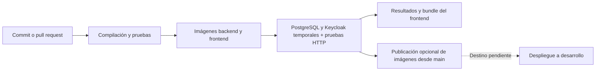

# Automatizaciones DevOps con Azure DevOps

El repositorio puede servir como laboratorio para automatizar validación, empaquetado, publicación y despliegue. El pipeline de `azure-pipelines.yml` prepara los tres primeros pasos; el despliegue queda pendiente de definir el destino.



## Qué se automatiza

| Paso | Comprobación o resultado |
| --- | --- |
| Backend | Restore, build Release y pruebas de dominio, aplicación, infraestructura y arquitectura con .NET 10 |
| Frontend | Instalación mediante `npm ci`, compilación TypeScript y bundle Vite |
| Contenedores | Construcción de las imágenes de backend y frontend |
| Integración | Base nueva con los scripts SQL, realm real de Keycloak, API y Nginx; IA simulada explícitamente |
| Pruebas HTTP | Un flujo de integración con 23 solicitudes a la API: permisos, registro, validación, evaluación, reprocesamiento y descarga de PDF a través del proxy de Nginx |
| Evidencias | Resultados TRX en Azure DevOps, bundle del frontend y resumen JSON de integración; logs de contenedores si falla |
| Publicación opcional | Las imágenes ya probadas se etiquetan con el SHA del commit y se envían al registro configurado |

El CV de las pruebas se genera en memoria con datos ficticios. No requiere archivos PDF locales ni una clave de Gemini. Esta comprobación no cubre la respuesta del proveedor real ni la interacción visual en navegador.

Verificación local del 2 de octubre de 2026, después de [depurar las pruebas](revision-pruebas.md): 56 casos .NET y un flujo de integración con 23 solicitudes a la API contra las imágenes Docker construidas. El entorno temporal se limpió correctamente. La sintaxis YAML se validó localmente; la ejecución en Azure DevOps y la publicación al registro requieren configurar el pipeline y la conexión de servicio.

## Activar el pipeline

1. Subir estos archivos al repositorio de Azure Repos.
2. En **Pipelines → New pipeline**, seleccionar **Azure Repos Git**, este repositorio y **Existing Azure Pipelines YAML file**: `/azure-pipelines.yml`.
3. Ejecutar con `publishImages=false`, que es el valor predeterminado. El agente necesita acceso a NuGet, npm y los registros públicos de contenedores. La configuración usa un agente hospedado Ubuntu; la organización debe tener capacidad de ejecución disponible.
4. En **Repos → Branches → main → Branch policies → Build validation**, agregar este pipeline como validación automática requerida. Repetir para `develop` si se utiliza esa rama.

Los pushes a `main`, `develop` y `feature/*` disparan CI. Los pushes a `feature/*` ejecutan compilación y pruebas rápidas; la integración Docker se ejecuta para pull requests, `main`, `develop` y ejecuciones manuales. En Azure Repos, la validación de pull requests se activa mediante la política de rama, no mediante un bloque YAML `pr`. Véase la [documentación de Azure Repos y pipelines](https://learn.microsoft.com/en-us/azure/devops/pipelines/repos/azure-repos-git?view=azure-devops).

Los resultados de pruebas aparecen en la pestaña **Tests**. En **Artifacts** se descargan `frontend-bundle` e `integration-results`. Un paso fallido impide avanzar a la publicación.

## Ejecutar la integración localmente

Requiere Node.js 22 o posterior y Docker con Compose v2 y contenedores Linux. Desde la raíz:

```powershell
node automation/scripts/ci-stack.mjs
```

El script construye las imágenes, crea un proyecto Compose con nombre aleatorio, asigna puertos disponibles, espera la disponibilidad de los servicios y ejecuta las pruebas. Al terminar, elimina los contenedores, la red y los volúmenes de ese entorno temporal. Las imágenes construidas permanecen disponibles. El Compose de uso habitual es independiente del archivo `automation/compose.ci.yml`.

Si se interrumpe el proceso, se puede completar la limpieza de su entorno registrado en `ci-results/stack.json`:

```powershell
node automation/scripts/ci-stack.mjs cleanup
```

Azure ejecuta también esta limpieza como paso final. `ci-results/` está excluido de Git y contiene el resumen, la identificación del entorno y los logs cuando falla.

## Habilitar la publicación de módulos

Backend y frontend son las dos unidades desplegables actuales. Las capas Domain, Application e Infrastructure forman parte del backend.

1. Crear o elegir un registro de contenedores.
2. Crear una conexión de tipo **Docker Registry** en **Project settings → Service connections**, con permisos de publicación para ese registro. Autorizar su uso por este pipeline.
3. Al ejecutar el pipeline, establecer `publishImages=true`, `registryServiceConnection` con el nombre de esa conexión y `registryHost` con el host del registro, por ejemplo `mi-registro.azurecr.io`.

La publicación solo se ejecuta desde `main`, después de superar las comprobaciones. No publica imágenes en la validación de un pull request. Las credenciales se suministran mediante la conexión de servicio de [Docker@2](https://learn.microsoft.com/en-us/azure/devops/pipelines/tasks/reference/docker-v2?view=azure-pipelines).

Se publican `REGISTRO/ats/backend:SHA_COMMIT` y `REGISTRO/ats/frontend:SHA_COMMIT`. El pipeline reutiliza las imágenes que pasaron la integración. Conviene configurar el registro para impedir que se sobrescriban las etiquetas de versiones publicadas.

## Próximas automatizaciones

Una vez elegido el destino, se puede agregar un ambiente de desarrollo, despliegue con esas versiones, comprobación de salud y reversión a la versión anterior. Para ello faltan el servidor o servicio de ejecución, las URLs públicas, el almacenamiento persistente y la conexión de servicio correspondiente.

El frontend actual tiene valores locales predeterminados para Keycloak. Al definir las URLs de publicación habrá que proporcionar su configuración y los redirect URIs del realm. El archivo de integración utiliza credenciales de pruebas y `start-dev` de Keycloak; el despliegue necesita su propia configuración.

Luego se pueden incorporar ambientes de pruebas y producción con aprobaciones, migraciones de base de datos, copias de seguridad verificadas y análisis de dependencias e imágenes. Una migración requiere su estrategia de recuperación además de la reversión de las imágenes de aplicación.
