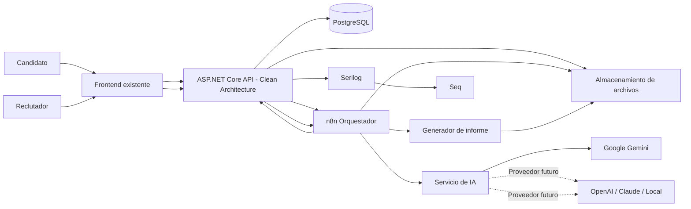
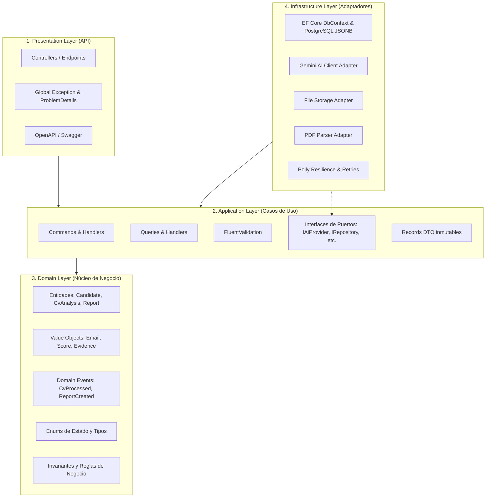
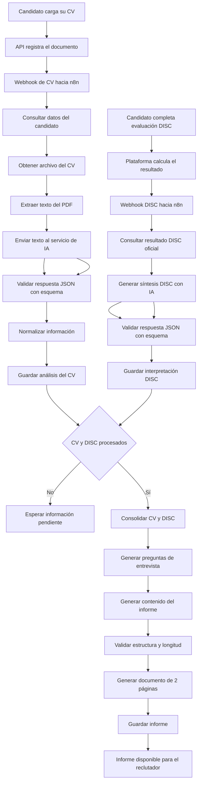
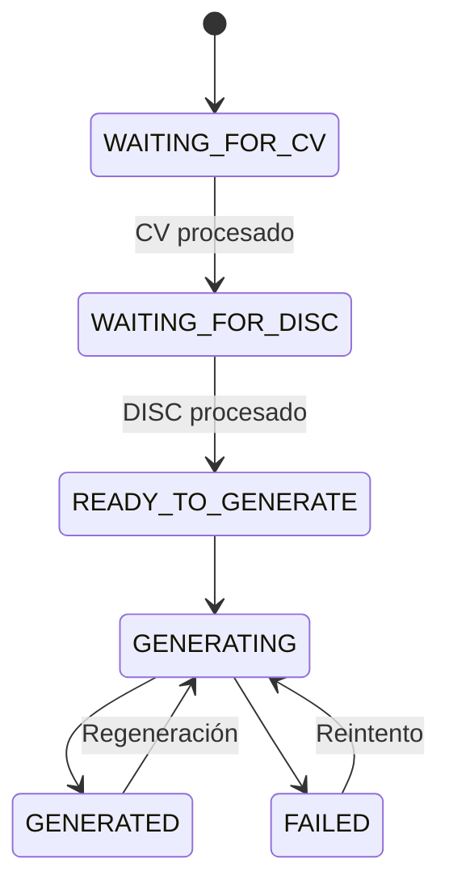
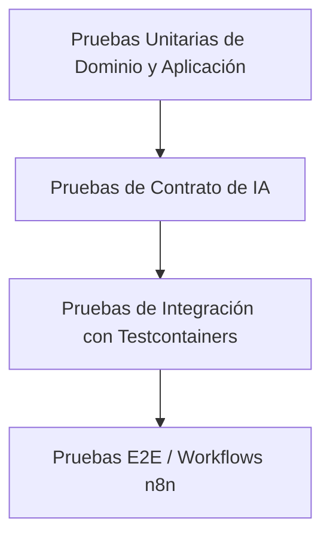

# Software Design Document

## Sistema de evaluacion y seleccion de talento basado en CV y DISC (TalentIQ ATS)

**Versión:** 2.5  
**Estado:** Aprobado e Implementado  
**Fecha:** 7 de septiembre de 2026  
**Tipo de solución:** Prototipo Funcional y Arquitectonico / MVP Demostrativo  
**Proveedor de IA:** Google Gemini (`gemini-flash-lite-latest` con cadena de resiliencia multi-modelo)  
**Servidor de Identidad:** Keycloak 26 con RBAC y OIDC PKCE  

---

## 1. Propósito

El propósito de este documento es definir el diseño técnico del sistema para gestionar vacantes y generar automáticamente un informe preentrevista y guía STAR a partir de:

- El CV cargado por el candidato o reclutador en formato PDF.
- El catálogo formal de vacantes y perfiles de puesto (`Job Positions`).
- El resultado oficial de la evaluación DISC y su perfil primario.
- Información básica y de contacto del candidato.

El informe tiene un máximo de dos páginas y está dirigido al reclutador o entrevistador comisionado.

El sistema sirve como herramienta de apoyo para preparar la entrevista. No realiza diagnósticos psicológicos clínicos ni toma decisiones automáticas no supervisadas de contratación.

---

## 2. Contexto actual

La plataforma permite:

1. Crear y gestionar vacantes formales con requisitos técnicos, experiencia y departamento.
2. Registrar candidatos vinculados a vacantes o cargos específicos.
3. Cargar directamente el CV en formato PDF con validación y sanitización en memoria.
4. Capturar o importar los resultados del test conductual DISC.
5. Delegar expedientes de candidatos entre evaluadores y administradores.
6. Analizar el CV y generar la síntesis DISC y guía situacional STAR en tiempo real con Google Gemini AI.
7. Emitir el dictamen oficial de la entrevista (Aprobado, En Reserva, Descartado) con notas de auditoría.

---

## 3. Objetivo del Sistema

Cuando se crea una vacante y se carga el CV junto a los puntajes DISC, el sistema debe:

1. Extraer el texto del CV en memoria con `PdfPigTextExtractor`.
2. Aplicar la heurística de seguridad `CvSecuritySanitizer` para neutralizar ataques de Prompt Injection.
3. Obtener información profesional estructurada con Gemini AI bajo JSON Schema estricto.
4. Validar las evidencias y citas textuales de competencias en C# (*Grounding Check*).
5. Recuperar el resultado conductual DISC y generar su síntesis orientada al desempeño laboral.
6. Consolidar la información del CV, vacante y DISC.
7. Generar preguntas situacionales STAR (profesionales, técnicas y conductuales).
8. Crear el informe ejecutivo de dos páginas en PDF mediante `QuestPDF`.
9. Permitir al reclutador visualizar el expediente en una consola web responsiva y emitir su dictamen.

---

## 4. Alcance

### 4.1 Incluido e Implementado en la Solución
- Catálogo formal de puestos y vacantes (`Job Positions`) con endpoints REST y formulario modal.
- Ingesta directa de candidatos y evaluación IA en tiempo real con seguimiento visual de fases.
- Procesamiento de archivos PDF con límite de 15 MB.
- Extracción de texto y análisis de experiencia laboral, formación, certificaciones y habilidades.
- Registro y validación estricta de evidencias encontradas en el CV (*Evidence Grounding Check*).
- Síntesis conductual DISC y gráfico interactivo de radar hexagonal SVG escalable.
- Generación de preguntas situacionales STAR.
- Generación y descarga del informe ejecutivo oficial de dos páginas en PDF.
- Persistencia relacional en PostgreSQL 16 con llaves foráneas indexadas y campos JSONB.
- Servidor de Identidad Keycloak 26.2 con roles corporativos (`ats_admin`, `ats_recruiter`), flujo PKCE y tema visual responsivo `talentiq`.
- Blindaje multicapa contra Prompt Injection (`CvSecuritySanitizer`, `systemInstruction`, delimitadores XML).
- Mitigaciones de seguridad en backend: Path Traversal, validación HMAC timing-safe y ProblemDetails RFC 7807.
- Interfaz web responsiva mobile-first en React 19 y Tailwind CSS adaptada a smartphones, tabletas y escritorio.

### 4.2 Fuera del alcance (Fases Futuras)
- Matching semántico avanzado con `pgvector` y modelos de embeddings locales.
- Ranking algorítmico y porcentaje automatizado de compatibilidad.
- Descarte automático de candidatos sin supervisión humana (contra directivas éticas y HITL).
- Transcripción automatizada de audio de entrevistas en vivo.
- Notificaciones en tiempo real vía WebSockets (SignalR) para delegación inmediata.
- Portal público de auto-postulacion directa para postulantes con captcha empresarial.

---

## 5. Actores

### 5.1 Candidato

El candidato podrá:

- Registrar sus datos.
- Cargar su CV.
- Realizar la evaluación DISC.

### 5.2 Reclutador o entrevistador

El reclutador podrá:

- Consultar candidatos.
- Visualizar el estado de procesamiento.
- Visualizar el informe preentrevista.
- Descargar el informe.
- Solicitar la regeneración del informe.
- Utilizar las preguntas sugeridas durante la entrevista.

### 5.3 Administrador

El administrador podrá:

- Consultar errores.
- Revisar procesos fallidos.
- Ejecutar reintentos.
- Consultar versiones de informes.
- Configurar el proveedor y modelo de IA.
- Supervisar la integración con n8n.

### 5.4 Servicio n8n

El servicio n8n podrá:

- Recibir eventos del backend.
- Consultar información mediante endpoints internos.
- Invocar el servicio de IA.
- Enviar los resultados procesados al backend.

---

## 6. Arquitectura general

El sistema sigue los principios de **Clean Architecture (Arquitectura Limpia / Puertos y Adaptadores)** en el backend, desacoplando la lógica de negocio central de los detalles tecnológicos de persistencia, servicios externos y transporte.

### 6.1 Diagrama de componentes del sistema



### 6.2 Diagrama de capas del Backend (.NET Clean Architecture)



---

## 7. Flujo principal



---

## 8. Componentes
## 8. Componentes del sistema y diseño por capas

### 8.1 Frontend existente

Responsabilidades:

- Permitir la carga del CV.
- Permitir la realización de la evaluación DISC.
- Mostrar el estado del procesamiento.
- Mostrar el informe al reclutador.
- Permitir la descarga del informe.
- Permitir solicitar una regeneración.
- Mostrar el estado del procesamiento en tiempo real o reactivo.
- Mostrar el informe preentrevista al reclutador.
- Permitir la descarga del informe en formato PDF.
- Permitir solicitar una regeneración manual del informe.

### 8.2 ASP.NET Core API
### 8.2 ASP.NET Core Backend (Estructura Clean Architecture)

Responsabilidades:
El backend está estructurado en 4 capas concéntricas con regla de dependencia estricta (las capas externas conocen a las internas, nunca a la inversa):

- Registrar el CV.
- Asociar documentos con candidatos.
- Registrar la finalización de la evaluación DISC.
- Exponer endpoints internos para n8n.
- Mantener los estados del procesamiento.
- Guardar los resultados definitivos.
- Validar permisos.
- Permitir consultar y descargar informes.
- Registrar eventos y errores.
#### 8.2.1 Capa de Dominio (`Domain`)
- **Aislamiento total**: Sin dependencias de frameworks externos, librerías de persistencia ni SDKs de terceros.
- **Entidades de Dominio**: `Candidate`, `CvAnalysis`, `DiscInterpretation`, `InterviewReport`, `ProcessingJob`.
- **Value Objects**: Objetos inmutables que encapsulan reglas de validación (`CandidateEmail`, `SkillEvidence`, `DiscScores`, `PromptVersion`).
- **Domain Events**: Eventos inmutables como `CvAnalysisCompletedDomainEvent`, `InterviewReportGeneratedDomainEvent`.
- **Enums e Invariantes**: Estados del procesamiento y validación de reglas de negocio intrínsecas.

La lógica principal del negocio deberá mantenerse en ASP.NET Core y no exclusivamente en n8n.
#### 8.2.2 Capa de Aplicación (`Application`)
- **Casos de Uso (Use Cases)**: Organizados mediante el patrón CQRS (Comandos para mutación, Consultas para lectura).
- **Puertos / Interfaces Abstraídas**:
  - `ICvAnalyzer`: Contrato para análisis de CV.
  - `IDiscInterpreter`: Contrato para interpretación DISC.
  - `IReportGenerator`: Contrato para generación estructurada y renderizado del informe.
  - `IDocumentStorageService`: Abstracción del almacenamiento de archivos.
  - `IPdfTextExtractor`: Abstracción para extracción de texto en documentos.
  - `IUnitOfWork` e `IRepositories`: Abstracción del acceso a datos.
- **DTOs y Mapeos**: Objetos inmutables (`records`) para transferir datos entre capas.
- **Validaciones tempranas**: Reglas de validación aplicadas mediante `FluentValidation` en pipeline antes de llegar al dominio.
- **Pipeline Behaviors**: Cross-cutting concerns automáticos (Logging, Validation, Performance, Transactional Boundaries).

### 8.3 n8n
#### 8.2.3 Capa de Infraestructura (`Infrastructure`)
- **Adaptadores de Persistencia**: Implementación de repositorios con Entity Framework Core sobre PostgreSQL, aprovechando soporte nativo para columnas `JSONB`.
- **Adaptadores de IA**: Implementación de `GeminiAiProvider` implementando los puertos de IA requeridos.
- **Adaptadores de Almacenamiento**: Implementación de almacenamiento local o Cloud Blob Storage bajo `IDocumentStorageService`.
- **Adaptadores de Extracción PDF**: Implementación con librerías especializadas (e.g. `PdfPig`).
- **Resiliencia**: Configuración de políticas de reintento, circuit breaker y timeout con `Polly`.

#### 8.2.4 Capa de Presentación / API (`API`)
- **Endpoints REST**: Controladores delgados o Minimal APIs que delegan la ejecución a los casos de uso.
- **Manejo Global de Excepciones**: Middleware centralizado que transforma errores en respuestas estándar RFC 7807 (`ProblemDetails`).
- **Autenticación y Autorización**: Control de acceso basado en roles (Reclutador, Administrador) y autenticación segura de webhooks.

### 8.3 n8n (Orquestador de flujos de integración)

Responsabilidades:

- Recibir webhooks.
- Consultar información mediante la API.
- Obtener el archivo del CV.
- Extraer el texto del PDF.
- Invocar al servicio de IA.
- Validar las respuestas.
- Coordinar los pasos del procesamiento.
- Ejecutar reintentos controlados.
- Informar la finalización del proceso.
- Recibir webhooks de eventos emitidos por la API.
- Coordinar la secuencia de llamadas asíncronas entre la API, almacenamiento y servicios de IA.
- Ejecutar reintentos automáticos a nivel de workflow ante fallos transitorios de red.
- Enviar resultados normalizados a la API.

n8n funcionará como orquestador y no como fuente principal de datos.
*Nota arquitectónica:* n8n actúa como orquestador de integración externa; las reglas de negocio e integridad de datos residen en la capa de aplicación y dominio de .NET.

### 8.4 Servicio de IA
### 8.4 Servicio de IA (Google Gemini inicial)

Responsabilidades:

- Extraer información estructurada del CV.
- Generar un resumen profesional.
- Identificar skills y sus evidencias.
- Generar una síntesis del resultado DISC.
- Proponer preguntas para la entrevista.
- Crear el contenido estructurado del informe.
- Extraer información estructurada del CV según esquema JSON estricto.
- Generar resumen profesional e identificar skills con evidencias.
- Generar síntesis narrativa y neutral del resultado DISC.
- Proponer preguntas contextualizadas para la entrevista.

El proveedor inicial será Google Gemini.
---

El diseño deberá permitir reemplazar Gemini por otro proveedor sin modificar los contratos internos ni la lógica principal.
## 9. Principios SOLID, Clean Code y Patrones de Diseño

### 8.5 PostgreSQL
### 9.1 Principios SOLID aplicados

Responsabilidades:
1. **Single Responsibility Principle (SRP - Responsabilidad Única)**:
   - Cada clase, handler y servicio posee un único propósito y motivo de cambio.
   - La extracción de texto PDF (`IPdfTextExtractor`) está desacoplada del análisis semántico con IA (`ICvAnalyzer`).
   - La validación de esquemas JSON se realiza en componentes dedicados independientes de la capa de transporte.

- Almacenar candidatos.
- Almacenar referencias de documentos.
- Almacenar resultados DISC.
- Almacenar análisis del CV.
- Almacenar interpretaciones DISC.
- Almacenar informes.
- Almacenar estados y errores.
- Mantener versiones y trazabilidad.
2. **Open/Closed Principle (OCP - Abierto/Cerrado)**:
   - El sistema es extensible a nuevos proveedores de IA (OpenAI, Claude, LLMs locales) o nuevos motores de renderizado de informes (HTML a PDF, QuestPDF, Typst) implementando nuevas clases que cumplan con los puertos/interfaces existentes, sin modificar los casos de uso.

### 8.6 Almacenamiento de archivos
3. **Liskov Substitution Principle (LSP - Sustitución de Liskov)**:
   - Cualquier implementación de `IAiProvider` o `IDocumentStorageService` puede sustituir a la implementación actual de Gemini o Storage local sin alterar la corrección del flujo de la aplicación ni violar contratos.

Responsabilidades:
4. **Interface Segregation Principle (ISP - Segregación de Interfaces)**:
   - En lugar de una interfaz gigante monolítica de IA, se definen interfaces cohesivas y especializadas:
     - `ICvAnalyzer` (análisis y extracción de CV).
     - `IDiscInterpreter` (síntesis de DISC).
     - `IInterviewQuestionGenerator` (generación de preguntas).
     - `IReportDocumentRenderer` (generación de archivo físico de 2 páginas).

- Guardar los CV de forma privada.
- Guardar los informes generados.
- Permitir acceso solamente a usuarios o servicios autorizados.
- Proporcionar identificadores o rutas seguras.
5. **Dependency Inversion Principle (DIP - Inversión de Dependencias)**:
   - Los módulos de alto nivel (casos de uso de `Application` y entidades de `Domain`) no dependen de módulos de bajo nivel (`Infrastructure`, SDKs de Gemini, PostgreSQL). Ambos dependen de abstracciones (interfaces).
   - Las dependencias se inyectan en tiempo de ejecución mediante el contenedor IoC nativo de .NET (`Microsoft.Extensions.DependencyInjection`).

### 8.7 Generador de informes
### 9.2 Prácticas de Clean Code y DDD Táctico

Responsabilidades:
- **Lenguaje Ubicuo (Ubiquitous Language)**: Términos consistentes en todo el código, base de datos y documentación (`Candidate`, `CvAnalysis`, `DiscInterpretation`, `InterviewReport`, `SkillEvidence`).
- **Inmutabilidad y DTOs expresivos**: Uso de `records` en C# para DTOs, comandos, queries y eventos de dominio, garantizando inmutabilidad y seguridad ante concurrencia.
- **Value Objects y Strongly-Typed IDs**: Evitar la obsesión primitiva (*Primitive Obsession*) utilizando tipos fuertemente tipados (e.g. `CandidateId`, `ReportId`, `Email`) en lugar de `Guid` o `string` planos.
- **Fail-Fast**: Validación inmediata de entradas en la frontera del sistema con `FluentValidation` para rechazar peticiones inválidas antes de procesar lógica pesada.
- **Patrón Result (`Result<T, Error>`)**: Manejo explícito y funcional de errores de negocio o validación, reservando las excepciones de .NET únicamente para casos verdaderamente excepcionales o fallos no recuperables del sistema.

- Recibir el contenido estructurado del informe.
- Aplicar una plantilla.
- Controlar la cantidad de contenido.
- Generar un documento de máximo dos páginas.
- Guardar el archivo.
- Devolver su ubicación o identificador.

---

## 9. Integración con inteligencia artificial
## 10. Integración con inteligencia artificial

### 9.1 Diseño independiente del proveedor
### 10.1 Diseño independiente del proveedor (Patrón Adapter & Strategy)

La plataforma no deberá depender directamente de campos, formatos o funcionalidades exclusivas de Gemini.
La plataforma no depende directamente del SDK ni de contratos propios de Google Gemini. Se utilizan puertos de aplicación y adaptadores de infraestructura:

Se utilizarán contratos JSON internos definidos por el sistema.

La integración deberá seguir una abstracción conceptual similar a:

```text
IAiProvider
├── AnalyzeCv
├── InterpretDisc
└── GenerateInterviewReport
```
Application Layer (Ports):
├── ICvAnalyzer
├── IDiscInterpreter
└── IInterviewQuestionGenerator

La implementación inicial será:

```text
GeminiAiProvider
Infrastructure Layer (Adapters):
├── GeminiCvAnalyzer (implementa ICvAnalyzer)
├── GeminiDiscInterpreter (implementa IDiscInterpreter)
└── GeminiQuestionGenerator (implementa IInterviewQuestionGenerator)
```

Implementaciones futuras posibles:

Posibles adaptadores futuros:
```text
OpenAiProvider
AzureOpenAiProvider
ClaudeAiProvider
LocalAiProvider
├── OpenAiCvAnalyzer
├── ClaudeCvAnalyzer
└── LocalLlmCvAnalyzer
```

### 9.2 Configuración del proveedor
### 10.2 Configuración segura y tipada (`IOptions<AiOptions>`)

La configuración deberá incluir:
La configuración se gestiona mediante el patrón `IOptions<T>` fuertemente tipado:

```text
ProviderName
ModelName
ApiKey
Endpoint
Timeout
MaximumRetries
PromptVersion
```csharp
public record AiProviderOptions
{
    public string ProviderName { get; init; } = "GoogleGemini";
    public string ModelName { get; init; } = "gemini-1.5-flash";
    public string ApiKey { get; init; } = string.Empty;
    public string Endpoint { get; init; } = string.Empty;
    public int TimeoutSeconds { get; init; } = 30;
    public int MaximumRetries { get; init; } = 3;
    public string PromptVersion { get; init; } = "v1.0";
}
```

Las credenciales no deberán guardarse directamente en el código fuente.
Las credenciales se suministran mediante variables de entorno o gestores de secretos (e.g. Azure Key Vault / AWS Secrets Manager) y nunca se guardan en el repositorio.

### 9.3 Responsabilidades no permitidas
### 10.3 Responsabilidades no permitidas para la IA

El servicio de IA no deberá:

- Recalcular los valores DISC.
- Modificar los resultados DISC oficiales.
- Realizar diagnósticos psicológicos.
- Inventar experiencia laboral.
- Inventar estudios o certificaciones.
- Asumir que una skill no mencionada es desconocida.
- Decidir si el candidato debe ser contratado.
- Descartar candidatos automáticamente.
- Recalcular los valores D, I, S y C oficiales.
- Modificar los resultados DISC oficiales provistos por la plataforma.
- Realizar diagnósticos psicológicos o clínicos.
- Inventar experiencia laboral, cargos o empresas.
- Inventar estudios, títulos o certificaciones.
- Asumir que una skill no mencionada en el CV es desconocida por el candidato.
- Emitir veredictos automáticos de contratación o descarte.

---

## 10. Automatizaciones con n8n
## 11. Automatizaciones con n8n

### 10.1 Workflow de procesamiento del CV
### 11.1 Workflow de procesamiento del CV

```text
Webhook cv-uploaded
    ↓
Validar autenticación
Validar autenticación del webhook
    ↓
Consultar datos del documento
Consultar datos del documento en API
    ↓
Descargar CV
Descargar CV desde almacenamiento
    ↓
Validar tipo y tamaño
Validar tipo de archivo y tamaño
    ↓
Extraer texto del PDF
Extraer texto del PDF (IPdfTextExtractor)
    ↓
Validar contenido
Validar contenido textual mínimo
    ↓
Enviar texto al servicio de IA
Enviar texto al servicio de IA (ICvAnalyzer)
    ↓
Validar respuesta JSON
Validar respuesta JSON contra esquema
    ↓
Normalizar skills
Normalizar skills y calcular evidencias
    ↓
Guardar análisis mediante la API
Guardar análisis mediante la API (.NET)
    ↓
Actualizar estado
Actualizar estado a PROCESSED
```

### 10.2 Workflow de procesamiento DISC
### 11.2 Workflow de procesamiento DISC

```text
Webhook disc-completed
    ↓
Validar autenticación
Validar autenticación del webhook
    ↓
Consultar resultado DISC oficial
Consultar resultado DISC oficial en API
    ↓
Validar valores D, I, S y C
    ↓
Enviar resultado al servicio de IA
Enviar resultado al servicio de IA (IDiscInterpreter)
    ↓
Generar síntesis para entrevista
Generar síntesis narrativa para entrevista
    ↓
Validar respuesta JSON
Validar respuesta JSON contra esquema
    ↓
Guardar interpretación mediante la API
Guardar interpretación mediante la API (.NET)
    ↓
Actualizar estado
Actualizar estado a PROCESSED
```

### 10.3 Workflow de generación del informe
### 11.3 Workflow de generación del informe

```text
CV procesado
    +
DISC procesado
CV procesado + DISC procesado
    ↓
Consultar información consolidada
Consultar información consolidada en API
    ↓
Generar preguntas
Generar preguntas de entrevista (IInterviewQuestionGenerator)
    ↓
Generar contenido estructurado
Generar contenido estructurado del informe
    ↓
Validar secciones y longitud
Validar secciones, límites y longitud
    ↓
Crear documento de dos páginas
Renderizar documento físico de dos páginas (IReportDocumentRenderer)
    ↓
Guardar documento
Guardar documento en almacenamiento seguro
    ↓
Registrar versión
Registrar versión y metadata en PostgreSQL
    ↓
Actualizar estado
Actualizar estado a GENERATED
```

---

## 11. Eventos
## 12. Eventos

### 11.1 Evento de CV cargado
### 12.1 Evento de CV cargado

```json
{
  "eventId": "uuid",
  "eventType": "CV_UPLOADED",
  "candidateId": "uuid",
  "documentId": "uuid",
  "occurredAt": "2026-09-04T10:00:00Z",
  "correlationId": "uuid"
}
```

### 11.2 Evento de DISC completado
### 12.2 Evento de DISC completado

```json
{
  "eventId": "uuid",
  "eventType": "DISC_COMPLETED",
  "candidateId": "uuid",
  "discResultId": "uuid",
  "occurredAt": "2026-09-04T10:15:00Z",
  "correlationId": "uuid"
}
```

### 11.3 Idempotencia
### 12.3 Idempotencia y Transaccionalidad

Los webhooks podrían recibirse más de una vez.
Los webhooks podrían recibirse más de una vez debido a reintentos de red.

Antes de procesar un evento, el sistema deberá comprobar si el `eventId` ya fue registrado.
- **Verificación de idempotencia**: Antes de procesar un evento, el sistema comprueba en la tabla `processed_events` o `processing_jobs` si el `eventId` ya fue registrado.
- **Respuesta idempotente**: Si el evento ya fue procesado, se devuelve inmediatamente HTTP `200 OK` sin duplicar operaciones ni generar sobrecostos en llamadas a IA.
- **Unit of Work**: Los cambios de estado y almacenamiento de resultados se ejecutan bajo una transacción atómica.

Si el evento ya fue procesado, se devolverá una respuesta exitosa sin repetir la operación.

---

## 12. Contrato del análisis del CV
## 13. Contrato del análisis del CV

```json
{
  "professionalSummary": "Desarrollador backend con experiencia en .NET.",
  "currentRole": "Backend Developer",
  "estimatedSeniority": "Semi Senior",
  "totalExperienceYears": 4,
  "skills": [
    {
      "name": ".NET",
      "normalizedName": "Microsoft .NET",
      "category": "Backend",
      "experienceYears": 4,
      "evidence": "Desarrollo de APIs con ASP.NET Core",
      "confidence": 0.95
    }
  ],
  "languages": [
    {
      "name": "Inglés",
      "level": "B2",
      "evidence": "Nivel indicado directamente en el CV"
    }
  ],
  "education": [],
  "certifications": [],
  "workExperience": [],
  "pointsToValidate": [],
  "warnings": []
}
```

### Reglas del contrato

- La información no encontrada deberá devolverse como `null` o arreglo vacío.
- No se deberán completar datos mediante suposiciones.
- Cada skill relevante deberá incluir evidencia.
- La confianza representa una estimación técnica de extracción, no una evaluación del candidato.
- Los datos deberán validarse antes de guardarse.
- Cada skill relevante deberá incluir evidencia extraída del texto original.
- La confianza representa una estimación técnica de extracción, no una calificación del candidato.
- Los datos deberán validarse contra el esquema JSON antes de persistirse.

---

## 13. Contrato de interpretación DISC
## 14. Contrato de interpretación DISC

```json
{
  "primaryStyle": "D/C",
  "summary": "Perfil orientado a resultados y al seguimiento de estándares.",
  "strengthsToExplore": [
    "Toma de decisiones",
    "Atención al detalle"
  ],
  "pointsToExplore": [
    "Adaptación ante cambios de prioridad"
  ],
  "behavioralQuestionTopics": [
    "Decisiones con información limitada",
    "Manejo de desacuerdos"
  ],
  "disclaimer": "Esta síntesis es una guía de apoyo y debe interpretarse junto con otras fuentes de evaluación."
}
```

### Reglas del contrato

- Los valores D, I, S y C deberán provenir de la plataforma.
- La IA solamente generará una síntesis narrativa.
- La interpretación deberá utilizar lenguaje neutral.
- No deberá utilizar lenguaje clínico.
- Los aspectos identificados se presentarán como temas para explorar.
- Los valores D, I, S y C provienen exclusivamente del cálculo oficial de la plataforma.
- La IA solamente genera una síntesis narrativa orientada a la conversación.
- La interpretación debe mantener un tono estrictamente profesional y neutral.
- Se prohíbe el uso de lenguaje clínico o diagnósticos de personalidad.

---

## 14. Contrato del informe
## 15. Contrato del informe

```json
{
  "candidateOverview": {
    "name": "Nombre del candidato",
    "currentRole": "Backend Developer",
    "experienceYears": 4,
    "professionalSummary": "Profesional con experiencia en desarrollo backend."
  },
  "professionalProfile": {
    "mainSkills": [
      ".NET",
      "PostgreSQL",
      "Docker"
    ],
    "relevantExperience": [],
    "education": [],
    "languages": [],
    "certifications": []
  },
  "discSummary": {
    "primaryStyle": "D/C",
    "summary": "Perfil orientado a resultados y al seguimiento de estándares.",
    "strengthsToExplore": [],
    "pointsToExplore": []
  },
  "validationPoints": [
    {
      "topic": "Docker",
      "reason": "La tecnología se menciona, pero no se describe su utilización.",
      "source": "CV"
    }
  ],
  "interviewGuide": {
    "professionalQuestions": [],
    "technicalQuestions": [],
    "behavioralQuestions": []
  },
  "disclaimer": "Este informe sirve como apoyo para la entrevista y no reemplaza el criterio profesional del reclutador."
}
```

---

## 15. Modelo de datos simplificado
## 16. Modelo de datos y persistencia limpia

Para el MVP se utilizará JSONB para almacenar las respuestas estructuradas generadas por IA.
Se utiliza **Entity Framework Core** en la capa de Infraestructura mapeando entidades de Dominio a tablas relacionales de PostgreSQL con soporte nativo de tipos `JSONB` para los payloads generados por IA, garantizando flexibilidad y velocidad de consulta.

### 15.1 Análisis del CV
### 16.1 Análisis del CV (`candidate_cv_analyses`)

```text
candidate_cv_analyses
├── id
├── candidate_id
├── document_id
├── analysis JSONB
├── status
├── provider_name
├── model_name
├── prompt_version
├── error_message
├── created_at
└── updated_at
├── id (UUID, PK)
├── candidate_id (UUID, FK, Index)
├── document_id (UUID, FK)
├── analysis (JSONB)
├── status (VARCHAR(30))
├── provider_name (VARCHAR(50))
├── model_name (VARCHAR(50))
├── prompt_version (VARCHAR(20))
├── error_message (TEXT, Nullable)
├── created_at (TIMESTAMPTZ)
└── updated_at (TIMESTAMPTZ)
```

### 15.2 Interpretación DISC
### 16.2 Interpretación DISC (`candidate_disc_interpretations`)

```text
candidate_disc_interpretations
├── id
├── candidate_id
├── disc_result_id
├── interpretation JSONB
├── status
├── provider_name
├── model_name
├── prompt_version
├── error_message
└── created_at
├── id (UUID, PK)
├── candidate_id (UUID, FK, Index)
├── disc_result_id (UUID, FK)
├── interpretation (JSONB)
├── status (VARCHAR(30))
├── provider_name (VARCHAR(50))
├── model_name (VARCHAR(50))
├── prompt_version (VARCHAR(20))
├── error_message (TEXT, Nullable)
└── created_at (TIMESTAMPTZ)
```

### 15.3 Informe preentrevista
### 16.3 Informe preentrevista (`candidate_interview_reports`)

```text
candidate_interview_reports
├── id
├── candidate_id
├── cv_analysis_id
├── disc_interpretation_id
├── report_content JSONB
├── file_url
├── status
├── version
├── provider_name
├── model_name
├── prompt_version
├── error_message
├── generated_at
└── created_at
├── id (UUID, PK)
├── candidate_id (UUID, FK, Index)
├── cv_analysis_id (UUID, FK)
├── disc_interpretation_id (UUID, FK)
├── report_content (JSONB)
├── file_url (TEXT)
├── status (VARCHAR(30))
├── version (INT)
├── provider_name (VARCHAR(50))
├── model_name (VARCHAR(50))
├── prompt_version (VARCHAR(20))
├── error_message (TEXT, Nullable)
├── generated_at (TIMESTAMPTZ, Nullable)
└── created_at (TIMESTAMPTZ)
```

### 15.4 Trabajos de procesamiento
### 16.4 Trabajos de procesamiento (`processing_jobs`)

```text
processing_jobs
├── id
├── candidate_id
├── process_type
├── status
├── attempts
├── event_id
├── correlation_id
├── error_code
├── error_message
├── started_at
├── finished_at
└── created_at
├── id (UUID, PK)
├── candidate_id (UUID, FK)
├── process_type (VARCHAR(50))
├── status (VARCHAR(30))
├── attempts (INT)
├── event_id (UUID, Unique Index)
├── correlation_id (UUID, Index)
├── error_code (VARCHAR(50), Nullable)
├── error_message (TEXT, Nullable)
├── started_at (TIMESTAMPTZ)
├── finished_at (TIMESTAMPTZ, Nullable)
└── created_at (TIMESTAMPTZ)
```

---

## 16. Estados del procesamiento
## 17. Estados del procesamiento

### 16.1 Estados generales
### 17.1 Estados generales

```text
PENDING
PROCESSING
PROCESSED
FAILED
```

### 16.2 Estados del informe
### 17.2 Estados del informe

```text
WAITING_FOR_CV
WAITING_FOR_DISC
READY_TO_GENERATE
GENERATING
GENERATED
FAILED
```

### 16.3 Flujo de estados
### 17.3 Flujo de estados



El sistema también deberá soportar que el resultado DISC esté disponible antes de finalizar el procesamiento del CV.
El sistema soporta que el resultado DISC esté disponible antes de finalizar el procesamiento del CV.

---

## 17. Diseño del informe
## 18. Diseño del informe

### 17.1 Página 1: perfil del candidato
### 18.1 Página 1: perfil del candidato

La primera página incluirá:

- Nombre del candidato.
- Cargo actual.
- Años estimados de experiencia.
- Resumen profesional.
- Experiencia relevante.
- Skills principales.
- Formación académica.
- Idiomas.
- Certificaciones.
- Síntesis del resultado DISC.

### 17.2 Página 2: guía para la entrevista
### 18.2 Página 2: guía para la entrevista

La segunda página incluirá:

- Fortalezas para explorar.
- Aspectos por validar.
- Preguntas sobre experiencia.
- Preguntas técnicas.
- Preguntas conductuales.
- Espacio para notas.
- Aviso de uso responsable.

### 17.3 Restricciones
### 18.3 Restricciones

- Máximo de dos páginas.
- Contenido claro y resumido.
- Sin diagnóstico psicológico.
- Sin decisión automática de contratación.
- Sin información inventada.
- Sin porcentajes de compatibilidad en el MVP.
- Identificación de la fecha y versión.
- Indicación de que fue generado con asistencia de IA.

---

## 18. Reglas de negocio
## 19. Reglas de negocio

### RN-01

El informe solamente podrá generarse cuando exista:

- Un análisis de CV procesado.
- Una interpretación DISC procesada.
- Un candidato válido.

### RN-02

El resultado DISC deberá provenir del cálculo oficial de la plataforma.

### RN-03

La IA no podrá recalcular o modificar el resultado DISC.

### RN-04

Toda skill deberá incluir una evidencia del CV cuando resulte posible.

### RN-05

La ausencia de una skill en el CV no significa que el candidato no la conozca.

Redacción permitida:

```text
No se encontró evidencia de experiencia con Redis en el CV.
```

Redacción no permitida:

```text
El candidato no sabe Redis.
```

### RN-06

Los resultados DISC se utilizarán para generar temas de entrevista y no para descartar automáticamente al candidato.

### RN-07

El informe no deberá recomendar automáticamente contratar o rechazar al candidato.

### RN-08

El informe tendrá un máximo de dos páginas.

### RN-09

Cada generación deberá registrar:

- Proveedor de IA.
- Modelo utilizado.
- Versión del prompt.
- Fecha de generación.
- Versión del informe.
- Análisis de CV utilizado.
- Interpretación DISC utilizada.

### RN-10

Si el CV o resultado DISC cambia, deberá generarse una nueva versión del informe.

---

## 19. Validación de respuestas de IA
## 20. Validación de respuestas de IA y Fail-Fast

Toda respuesta generada por el servicio de IA deberá cumplir un esquema JSON.
Toda respuesta generada por el servicio de IA deberá validarse inmediatamente contra un esquema JSON estricto en la capa de aplicación antes de permitir que fluya hacia el dominio.

Las validaciones incluirán:

- JSON válido.
- Campos obligatorios presentes.
- JSON estructuralmente válido.
- Campos obligatorios presentes (`required`).
- Tipos de datos correctos.
- Arrays dentro de los límites permitidos.
- Skills sin duplicados.
- Arrays dentro de los límites máximos permitidos.
- Skills sin duplicados normalizados.
- Preguntas sin duplicados.
- Evidencias no vacías.
- Valores numéricos dentro del rango esperado.
- Ausencia de campos no permitidos.
- Ausencia de campos adicionales no permitidos (`additionalProperties: false`).
- Longitud máxima por sección.

### Flujo ante una respuesta inválida

```text
Respuesta inválida
Respuesta de IA
    ↓
Registrar el error
Validación de esquema JSON
    ↓
Ejecutar un reintento
    ↓
Volver a validar
    ↓
Si vuelve a fallar, marcar como FAILED
¿Es válida?
├── Sí ➔ Continuar flujo
└── No ➔ Registrar error en logs
         ↓
         Ejecutar reintento con Polly
         ↓
         Si supera intentos máximos ➔ Marcar Job como FAILED
```

---

## 20. Manejo de errores
## 21. Manejo de errores, Resiliencia y Estándar de Respuestas

Se deberán controlar los siguientes casos:
### 21.1 Patrón Result (`Result<T, Error>`)

- CV no encontrado.
- Formato no soportado.
- PDF dañado.
- PDF sin texto.
- Error de extracción.
- Resultado DISC no disponible.
- Servicio de IA no disponible.
- Tiempo de espera agotado.
- Respuesta JSON inválida.
- Error al guardar en PostgreSQL.
- Error al generar el documento.
- Error al guardar el informe.
- Evento duplicado.
- Candidato no encontrado.
Para mantener el código limpio y libre de excepciones innecesarias como mecanismo de control de flujo, los casos de uso en `Application` retornan objetos `Result<T>`:

### Reintentos
```csharp
public record Error(string Code, string Description);

Estrategia inicial:
public class Result<T>
{
    public bool IsSuccess { get; }
    public T? Value { get; }
    public Error? Error { get; }

```text
Primer reintento: 30 segundos
Segundo reintento: 2 minutos
Tercer reintento: 10 minutos
    // Métodos Success() y Failure()
}
```

Después del tercer intento, el proceso se marcará como:
### 21.2 Estándar de Errores en la API (RFC 7807 `ProblemDetails`)

```text
FAILED
Todos los errores HTTP devueltos por la API siguen el estándar internacional RFC 7807:

```json
{
  "type": "https://api.ats.com/errors/cv-processing-failed",
  "title": "Error al procesar el CV",
  "status": 422,
  "detail": "El archivo PDF no contiene texto extraíble.",
  "instance": "/api/v1/candidates/123/cv-analysis",
  "correlationId": "f47ac10b-58cc-4372-a567-0e02b2c3d479"
}
```

Un administrador podrá ejecutar un reintento manual.
### 21.3 Resiliencia con Polly en Infraestructura

Las llamadas salientes hacia Google Gemini, almacenamiento de archivos y servicios externos están protegidas por políticas de resiliencia configuradas con **Polly**:

1. **Retry con Exponential Backoff y Jitter**:
   - Reintento 1: ~2 segundos + jitter
   - Reintento 2: ~6 segundos + jitter
   - Reintento 3: ~15 segundos + jitter
2. **Circuit Breaker**:
   - Si el proveedor de IA falla consecutivamente en el 50% de las solicitudes durante 30 segundos, el circuito se abre por 1 minuto para evitar saturación.
3. **Timeout Policy**:
   - Timeout por solicitud individual de 30 segundos.

---

## 21. Seguridad y privacidad
## 22. Seguridad y privacidad

- El acceso a los informes estará limitado a usuarios autorizados.
- Los CV se almacenarán de forma privada.
- Las credenciales de Gemini se almacenarán como secretos.
- n8n utilizará una cuenta de servicio para comunicarse con la API.
- Los webhooks deberán estar autenticados.
- El acceso a los informes estará limitado a usuarios autenticados con rol de reclutador o administrador.
- Los CV se almacenarán en buckets privados con acceso restringido.
- Las credenciales de Gemini se almacenarán en el almacén de secretos.
- n8n se autenticará con la API mediante tokens JWT de cuenta de servicio.
- Los webhooks estarán firmados con HMAC o protegidos mediante tokens Bearer.
- No se registrará el contenido completo del CV en logs.
- No se registrarán respuestas completas de DISC en logs operativos.
- No se registrarán tokens, contraseñas o API keys.
- Los datos utilizados para pruebas deberán estar anonimizados.
- Solo se enviará al proveedor de IA la información necesaria.
- Se deberá establecer una política de retención y eliminación de datos.
- Las conexiones deberán utilizar HTTPS en ambientes desplegados.
- Solo se enviará al proveedor de IA la información estrictamente necesaria.
- Se establecerá una política de retención y eliminación de datos.
- Todas las conexiones en ambientes productivos requerirán HTTPS (TLS 1.3).

---

## 22. Observabilidad
## 23. Observabilidad y Monitoreo

ASP.NET Core utilizará Serilog para generar registros estructurados.
ASP.NET Core utilizará **Serilog** para generar registros estructurados enriquecidos con `CorrelationId` distribuido.

Seq podrá utilizarse para consultar y visualizar los logs.
Seq y OpenTelemetry podrán utilizarse para consultar métricas, trazas y visualizar logs.

Cada registro relacionado con el procesamiento deberá contener:
Cada registro relacionado con el procesamiento contendrá:

```text
Timestamp
CorrelationId
CandidateId
DocumentId
ProcessType
Status
Duration
ProviderName
ModelName
ErrorCode
```

No deberá contener:

- El texto completo del CV.
- Información personal innecesaria.
- Respuestas completas del DISC.
- Credenciales.
- Claves de API.

### Métricas iniciales

- Cantidad de CV procesados.
- Cantidad de informes generados.
- Porcentaje de procesos exitosos.
- Tiempo promedio de procesamiento.
- Cantidad de respuestas JSON inválidas.
- Cantidad de reintentos.
- Porcentaje de procesos exitosos vs fallidos.
- Tiempo promedio de procesamiento por etapa.
- Cantidad de respuestas JSON de IA inválidas.
- Cantidad de reintentos ejecutados por Polly.
- Cantidad de informes regenerados.
- Costo estimado por informe.
- Costo estimado de tokens por informe.

---

## 23. Requisitos no funcionales
## 24. Requisitos no funcionales

### Rendimiento

- La carga del CV no deberá esperar la respuesta de la IA.
- El procesamiento será asíncrono.
- El informe deberá generarse en un tiempo objetivo menor a cinco minutos.
- La consulta del informe deberá responder en menos de tres segundos bajo condiciones normales.
- La carga del CV no deberá bloquear al usuario ni esperar la respuesta de la IA (procesamiento asíncrono).
- El informe completo deberá generarse en un tiempo objetivo menor a 3 minutos.
- La consulta del informe pregenerado responderá en menos de 500 ms bajo condiciones normales.

### Disponibilidad

- Un fallo del servicio de IA no deberá bloquear la plataforma.
- Los procesos fallidos deberán poder reintentarse.
- La información del candidato no deberá perderse si n8n no está disponible.
- Un fallo temporal del proveedor de IA no bloqueará la plataforma ni causará pérdida de datos del candidato.
- Los procesos fallidos deberán poder reintentarse automáticamente o de forma manual por el administrador.

### Mantenibilidad

- Los prompts deberán estar versionados.
- Los workflows de n8n deberán exportarse y guardarse en control de versiones.
- Los contratos JSON deberán estar documentados.
- La configuración deberá separarse por ambiente.
- El proveedor de IA deberá poder reemplazarse.
- Arquitectura limpia desacoplada que permite reemplazar componentes sin impacto colateral.
- Prompts versionados en archivos de configuración externa o plantillas tipadas.
- Workflows de n8n exportables y versionados en Git.

### Trazabilidad
---

Cada informe deberá relacionarse con:
## 25. Estrategia de Pruebas y Calidad de Código

- Candidato.
- CV.
- Resultado DISC.
- Análisis del CV.
- Interpretación DISC.
- Proveedor de IA.
- Modelo.
- Versión del prompt.
- Fecha de generación.
- Versión del informe.
Para garantizar alta mantenibilidad, confiabilidad y ausencia de regresiones, el sistema implementa la **Pirámide de Pruebas**:



1. **Pruebas Unitarias (`Unit Tests`)**:
   - Cobertura de reglas de negocio en `Domain` e invariantes de entidades.
   - Cobertura de casos de uso y validadores en `Application` utilizando mocks para los puertos (`NSubstitute` o `Moq`).
2. **Pruebas de Contrato (`Contract / Schema Tests`)**:
   - Validación de los esquemas JSON esperados contra respuestas reales o mockeadas de modelos de IA para detectar cambios de comportamiento.
3. **Pruebas de Integración (`Integration Tests`)**:
   - `WebApplicationFactory` en ASP.NET Core junto con `Testcontainers` para levantar una instancia real de PostgreSQL en Docker durante la ejecución de los tests.
   - Verificación de persistencia EF Core, consultas JSONB y migraciones.
4. **Pruebas de Arquitectura (`Architecture Tests`)**:
   - Uso de `NetArchTest` para hacer cumplir automáticamente las reglas de Clean Architecture en CI/CD (e.g. verificar que la capa `Domain` no tenga dependencias de `Infrastructure` ni de `API`).

---

## 24. Criterios de aceptación
## 26. Criterios de aceptación

El MVP será aceptado cuando:

- [ ] El candidato pueda cargar un CV en formato PDF.
- [ ] La API registre el documento.
- [ ] n8n reciba el evento de carga.
- [ ] n8n pueda obtener el archivo.
- [ ] El texto del PDF pueda extraerse.
- [ ] Gemini devuelva información estructurada.
- [ ] La respuesta JSON sea validada.
- [ ] Las skills incluyan evidencia.
- [ ] La IA no invente experiencia o certificaciones.
- [ ] El análisis se guarde en PostgreSQL.
- [ ] Se detecte la finalización del DISC.
- [ ] Se utilice el resultado DISC oficial.
- [ ] La API registre el documento cumpliendo Clean Architecture.
- [ ] n8n reciba y autentique el evento de carga.
- [ ] El texto del PDF se extraiga mediante `IPdfTextExtractor`.
- [ ] Gemini devuelva información estructurada validada con JSON Schema.
- [ ] Las skills incluyan evidencia verificable del CV.
- [ ] La IA no invente experiencia ni certificaciones.
- [ ] El análisis se guarde en PostgreSQL con soporte JSONB.
- [ ] Se detecte la finalización del DISC y se use el resultado oficial.
- [ ] La síntesis DISC se guarde en PostgreSQL.
- [ ] El sistema espere cuando falte una entrada.
- [ ] El informe consolide CV y DISC.
- [ ] Se generen preguntas profesionales.
- [ ] Se generen preguntas técnicas.
- [ ] Se generen preguntas conductuales.
- [ ] El documento tenga un máximo de dos páginas.
- [ ] El reclutador pueda visualizar el informe.
- [ ] El reclutador pueda descargar el informe.
- [ ] El informe pueda regenerarse.
- [ ] Los errores queden registrados.
- [ ] Los procesos fallidos puedan reintentarse.
- [ ] Se registre el proveedor y modelo utilizados.
- [ ] Se registre la versión del prompt.
- [ ] El informe incluya el aviso de uso responsable.
- [ ] El informe consolide CV y DISC en máximo dos páginas.
- [ ] Se generen preguntas profesionales, técnicas y conductuales.
- [ ] El reclutador pueda visualizar y descargar el informe.
- [ ] Los errores se reporten bajo el estándar RFC 7807 `ProblemDetails`.
- [ ] Las pruebas unitarias, de integración y de arquitectura pasen exitosamente.

---

## 25. Plan de implementación
## 27. Plan de implementación

### Sprint 0: levantamiento
### Sprint 0: Fundación y Clean Architecture

Actividades:
- Configurar solución .NET en 4 proyectos (`Domain`, `Application`, `Infrastructure`, `API`).
- Configurar PostgreSQL con EF Core y soporte JSONB.
- Configurar contenedor de Docker con PostgreSQL y n8n.
- Definir entidades de Dominio, Value Objects y puertos principales.
- Configurar Serilog y pipeline de validación con FluentValidation.

- Revisar la estructura actual de candidatos.
- Identificar dónde se almacenan los CV.
- Revisar cómo se calcula DISC.
- Identificar el ID común del candidato.
- Diseñar la plantilla del informe.
- Preparar datos de prueba anonimizados.
- Configurar PostgreSQL, n8n y Gemini.

Entregable:
> Proyecto base con Clean Architecture configurada y pruebas de arquitectura pasando.

> Documento de integración con la plataforma existente.
### Sprint 1: Procesamiento de CV y Adaptador Gemini

### Sprint 1: procesamiento del CV

Actividades:
- Implementar `IPdfTextExtractor` con librería especializada.
- Implementar `ICvAnalyzer` con adaptador `GeminiAiProvider`.
- Diseñar y versionar el prompt de extracción de CV.
- Implementar validación de esquemas JSON y políticas de resiliencia con Polly.
- Crear workflow de n8n para orquestar la extracción.

- Registrar documentos desde la API.
- Crear el webhook de CV.
- Crear el workflow en n8n.
- Extraer texto del PDF.
- Integrar Gemini.
- Definir el esquema JSON.
- Validar la respuesta.
- Guardar el análisis.
- Registrar estados y errores.

Entregable:
> Análisis de CV estructurado y validado persistido en PostgreSQL.

> Análisis estructurado del CV almacenado en PostgreSQL.
### Sprint 2: Interpretación DISC y Síntesis

### Sprint 2: interpretación DISC

Actividades:
- Implementar `IDiscInterpreter` con adaptador Gemini.
- Diseñar y validar el prompt de síntesis DISC orientado a entrevista.
- Crear webhook y workflow de n8n para procesamiento de DISC.
- Implementar idempotencia transaccional en recepción de eventos.

- Detectar la finalización de DISC.
- Exponer el resultado oficial.
- Crear el webhook DISC.
- Generar la síntesis mediante Gemini.
- Validar la respuesta.
- Guardar la interpretación.
- Registrar estados y errores.

Entregable:
> Síntesis DISC neutral y temas de entrevista persistidos en base de datos.

> Síntesis DISC orientada a la entrevista.
### Sprint 3: Generación de Informe Preentrevista

### Sprint 3: informe preentrevista

Actividades:
- Implementar caso de uso de consolidación de CV y DISC.
- Implementar `IInterviewQuestionGenerator` e `IReportDocumentRenderer`.
- Diseñar la plantilla de 2 páginas (resumen ejecutivo + guía de entrevista).
- Implementar endpoints de consulta, descarga y regeneración de informe.

- Consolidar CV y DISC.
- Generar preguntas.
- Diseñar la plantilla.
- Generar el documento.
- Guardar el informe.
- Mostrarlo al reclutador.
- Habilitar descarga.
- Habilitar regeneración.

Entregable:
> Informe preentrevista de máximo 2 páginas generado y accesible para el reclutador.

> Informe preentrevista de máximo dos páginas.
### Sprint 4: Pruebas, Resiliencia y Validación

### Sprint 4: validación

Actividades:
- Ejecutar pruebas de integración con Testcontainers.
- Probar con diversos formatos de CV reales y anonimizados.
- Validar informes con reclutadores y ajustar prompts.
- Medir métricas de rendimiento, tiempos de respuesta y costos de API.

- Probar diferentes tipos de CV.
- Revisar informes con reclutadores.
- Evaluar la utilidad de las preguntas.
- Ajustar prompts.
- Ajustar la plantilla.
- Medir tiempos y errores.
- Evaluar costos del proveedor.

Entregable:
> MVP validado técnica y funcionalmente listo para despliegue.

> MVP validado con usuarios del negocio.

---

## 28. Decisiones Arquitectonicas Resueltas e Implementadas

Las siguientes decisiones tecnicas clave fueron formalmente resueltas e integradas en la solucion v2.5:

1. **Modelo de Lenguaje y Parametrizacion de IA:**
   - Adopcion de **Google Gemini 2.5 Flash** (`gemini-2.5-flash`).
   - Uso de `systemInstruction` nativo de la API de Gemini para imponer reglas de negocio de maxima prioridad jerarquica.
   - Forzado de formato JSON estricto mediante `responseMimeType: "application/json"`.

2. **Extraccion de Texto desde PDF:**
   - Implementacion de `PdfPigTextExtractor` con procesamiento en memoria y limite estricto de 15 MB por documento, asegurando rendimiento y proteccion contra agotamiento de recursos.

3. **Generacion del Informe Oficial:**
   - Implementacion con `QuestPdfReportGenerator` para componer el reporte ejecutivo oficial de 2 paginas con maquetacion vectorial y descarga directa.

4. **Identidad, Autenticacion y Control de Acceso (IAM / RBAC):**
   - Integracion de **Keycloak 26.2** contenerizado bajo el realm corporativo `ats-realm`.
   - Flujo seguro OIDC con **PKCE** en el cliente React y validacion criptografica de tokens JWT (JWKS) en el middleware de autorizacion de ASP.NET Core.
   - Tema corporativo personalizado y responsivo (`keycloak/themes/talentiq`).

5. **Catalogo de Vacantes (`Job Positions`):**
   - Modelado relacional en PostgreSQL mediante la tabla `job_positions` vinculada con Foreign Key indexada a `candidates(job_position_id)` con regla `ON DELETE SET NULL`.
   - Soporte completo CQRS en backend y modal reactivo para el alta corporativa de vacantes.

6. **Defensa contra Inyeccion de Prompts y Ataques a la Integridad:**
   - Modelo de **Defensa en Profundidad** en 4 capas (`CvSecuritySanitizer`, confinamiento XML, verificacion de evidencias en C# y Human-in-the-Loop).
   - Normalizacion de rutas absolutas en `StorageService` contra Path Traversal.
   - Validacion de webhooks con HMAC SHA-256 en tiempo constante (`CryptographicOperations.FixedTimeEquals`).

---

## 29. Evolucion Futura (Fases Posteriores)

Habiendo validado en produccion el informe preentrevista, la evaluacion DISC, el catalogo de vacantes y el diseno responsivo, el sistema continuara con:
- **Fase 8: Notificaciones Asincronas y Eventos en Tiempo Real:** SignalR en backend y WebSocket en frontend para alertar al evaluador ante nuevas delegaciones.
- **Fase 9: Portal Publico de Auto-Postulacion:** Interfaz externa para que los candidatos postulen directamente con captcha empresarial y rate limiting por IP.
- **Fase 10: Integracion con Calendarios Corporativos:** Sincronizacion de entrevistas con Google Calendar y Microsoft Outlook / Teams.
- **Fase 11: Busqueda Semantica y Matching con Embeddings:** Integracion de `pgvector` para busqueda por similitud vectorial entre requerimientos del puesto y perfiles de candidatos.

### Fase 3: búsqueda semántica

- Generación de embeddings.
- Instalación de pgvector.
- Perfiles vectorizados de candidatos.
- Perfiles vectorizados de vacantes.
- Búsqueda semántica.

### Fase 4: matching explicable

El matching podrá combinar:

```text
Similitud semántica
+
Skills obligatorias
+
Skills deseables
+
Experiencia
+
Idiomas
+
Certificaciones
```

El resultado DISC se utilizará para orientar la entrevista y no como criterio automático de descarte.

### Fase 5: ATS extendido

- Gestión de vacantes.
- Estados de postulación.
- Ranking de candidatos.
- Agenda de entrevistas.
- Notificaciones.
- Registro de entrevistas.
- Historial de decisiones.
- Dashboard de reclutamiento.

---

## 28. Riesgos y mitigaciones
## 30. Riesgos y mitigaciones

### Información incorrecta generada por IA
| Riesgo | Mitigación Arquitectónica |
| :--- | :--- |
| **Alucinaciones / Datos inventados por IA** | Esquemas JSON estrictos, obligación de evidencia textual y pruebas de contrato. |
| **PDF escaneado sin texto** | Detección temprana en `IPdfTextExtractor`, error controlado RFC 7807 y opción de reprocesamiento. |
| **Fallo o lentitud del proveedor de IA** | Políticas de resiliencia con Polly (Retry + Exponential Backoff + Circuit Breaker) y procesamiento asíncrono. |
| **Exposición de datos sensibles** | Aislamiento de almacenamiento, anonimización en tests y logs sanitizados sin datos PII. |
| **Acoplamiento al proveedor de IA** | Principio de Inversión de Dependencias (DIP) y patrón Adapter (`ICvAnalyzer`, `IDiscInterpreter`). |

Mitigaciones:

- Respuesta estructurada en JSON.
- Evidencia obligatoria para skills.
- Validación automática.
- Revisión humana.
- Versionado de prompts.

### CV sin texto extraíble

Mitigaciones:

- Detectar PDF escaneado.
- Mostrar un error controlado.
- Permitir procesamiento manual.
- Evaluar OCR en una fase posterior.

### Interpretación incorrecta de DISC

Mitigaciones:

- No recalcular los resultados.
- Utilizar el resultado oficial.
- Revisar los prompts con especialistas.
- Utilizar lenguaje neutral.
- Incluir un aviso de uso responsable.

### Informe mayor a dos páginas

Mitigaciones:

- Plantilla fija.
- Límite de caracteres por sección.
- Cantidad máxima de skills.
- Cantidad máxima de preguntas.
- Validación antes de generar el documento.

### Dependencia de Gemini

Mitigaciones:

- Utilizar contratos internos.
- Registrar proveedor y modelo.
- Separar la integración de la lógica de negocio.
- Permitir incorporar otro proveedor.

### Exposición de datos personales

Mitigaciones:

- Control de acceso.
- Almacenamiento privado.
- Logs sin contenido sensible.
- Secretos protegidos.
- Datos de prueba anonimizados.
- Política de retención.

---

## 29. Resumen técnico
## 31. Resumen técnico

```text
Entradas
├── CV en PDF
└── Resultado DISC oficial
├── CV en formato PDF
└── Resultado DISC oficial de la plataforma

Procesamiento
├── ASP.NET Core API
├── n8n
├── Servicio de IA
│   └── Google Gemini para el MVP
├── PostgreSQL
└── Generador de documentos
Arquitectura Backend (.NET 8/9 Clean Architecture)
├── Domain (Entidades, Value Objects, Domain Events, Invariantes)
├── Application (Casos de uso CQRS, Puertos, DTOs, FluentValidation, Result<T>)
├── Infrastructure (EF Core PostgreSQL JSONB, Gemini Adapter, Polly, Storage)
└── Presentation / API (REST Endpoints, Middleware RFC 7807 ProblemDetails)

Orquestación & Datos
├── n8n (Orquestador de workflows asíncronos)
└── PostgreSQL (Base de datos relacional + JSONB)

Salida
└── Informe preentrevista de máximo dos páginas
    ├── Resumen profesional
    ├── Experiencia relevante
    ├── Skills con evidencia
    ├── Síntesis DISC
    ├── Fortalezas para explorar
    ├── Aspectos por validar
    ├── Preguntas profesionales
    ├── Preguntas técnicas
    └── Preguntas conductuales
└── Informe preentrevista estructurado de máximo dos páginas
    ├── Página 1: Perfil profesional, skills con evidencia y síntesis DISC
    └── Página 2: Guía de preguntas contextualizadas y temas a validar
```

---

## 30. Conclusión
## 32. Conclusión

El MVP aprovechará la carga de CV y la evaluación DISC existentes para generar un informe preentrevista breve, estructurado y útil para el reclutador.
El diseño presentado para el MVP combina la robustez y mantenibilidad de **Clean Architecture**, la flexibilidad de los principios **SOLID**, la claridad del **Clean Code** y el pragmatismo de un pipeline asíncrono orquestado con n8n e impulsado por IA generativa (Google Gemini).

Google Gemini se utilizará inicialmente para realizar pruebas, pero el diseño permanecerá independiente del proveedor de IA.

La primera versión se enfocará en validar la calidad y utilidad del informe. El matching con vacantes, pgvector, ranking y demás funcionalidades del ATS serán incorporados en fases posteriores.

El informe será una herramienta de apoyo y no reemplazará el criterio profesional del reclutador o entrevistador.
El sistema garantiza una total independencia respecto al proveedor de IA y la infraestructura de almacenamiento, asegura el cumplimiento de altos estándares de seguridad y observabilidad, y proporciona al reclutador una herramienta de apoyo objetivo y contextualizado para optimizar el proceso de entrevista técnica y humana.